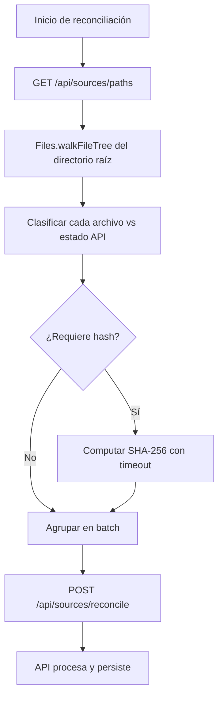
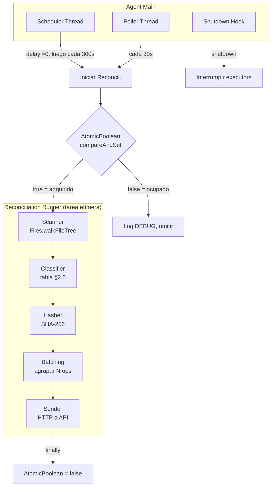
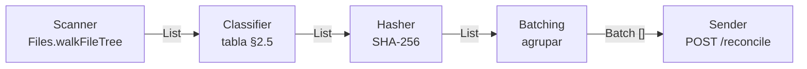
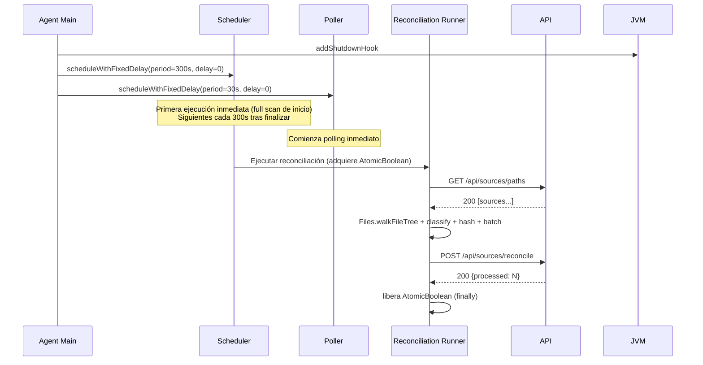
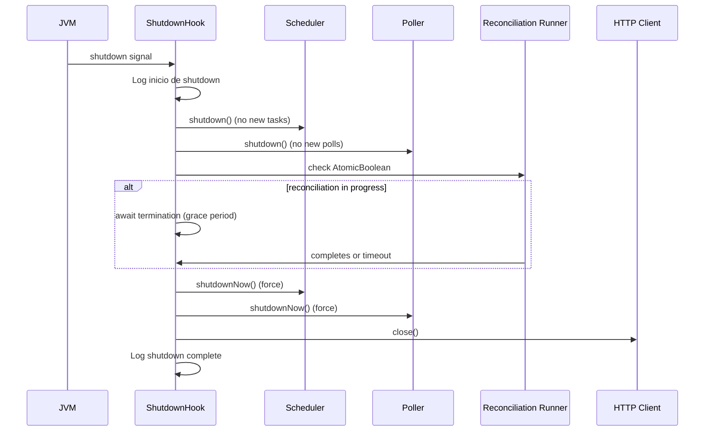

# agent

## 1. Stack detallado de tecnologías y dependencias

### 1.1. Lenguaje y build

| Capa               | Tecnología | Versión | Notas                                    |
|--------------------|------------|---------|------------------------------------------|
| Lenguaje           | Java       | 21      | —                                        |
| Build              | Maven      | —       | Wrapper en `agent/mvnw`                  |
| JSON serialización | Gson       | 2.13.1  | 0 dependencias transitivas               |
| Logging            | Log4j 2    | 2.23.1  | API directa (`log4j-api` + `log4j-core`) |

### 1.2. APIs del JDK utilizadas

| API                                                        | Propósito                                                         |
|------------------------------------------------------------|-------------------------------------------------------------------|
| `java.net.http.HttpClient`                                 | Comunicación HTTP con la API REST                                 |
| `java.nio.file.Files.walkFileTree()` + `SimpleFileVisitor` | Recorrido del árbol de directorios tolerante a fallos por archivo |
| `java.security.MessageDigest`                              | Cómputo de hash SHA-256                                           |
| `java.io.DigestInputStream`                                | Stream wrapper para hashear el contenido del archivo              |
| `java.util.concurrent.ScheduledExecutorService`            | Programación de reconciliaciones periódicas y polling             |
| `java.util.concurrent.atomic.AtomicBoolean`                | Lock entre reconciliaciones superpuestas                          |
| `java.text.Normalizer`                                     | Normalización Unicode NFC de paths                                |

### 1.3. Testing

| Framework | Versión         | Propósito             |
|-----------|-----------------|-----------------------|
| JUnit     | 6.1.1 (Jupiter) | Tests unitarios       |
| Mockito   | (por definir)   | Mocking de HttpClient |

### 1.4. Dependencias externas (fuera del JDK)

| Dependencia                                  | Ámbito  | Justificación                                       |
|----------------------------------------------|---------|-----------------------------------------------------|
| `com.google.code.gson:gson:2.13.1`           | compile | Serializar/deserializar JSON en comunicación HTTP   |
| `org.apache.logging.log4j:log4j-api:2.23.1`  | compile | API de logging                                      |
| `org.apache.logging.log4j:log4j-core:2.23.1` | runtime | Implementación de Log4j (solo necesaria en runtime) |
| `org.junit.jupiter:junit-jupiter:6.1.1`      | test    | Tests unitarios                                     |

## 2. Sincronización

### 2.1. Visión general

La reconciliación es el proceso mediante el cual el Agent sincroniza el estado del filesystem con el estado registrado
en la base de datos. Se ejecuta en tres escenarios:

- **Al iniciar** el Agent (*full scan*).
- **Periódicamente** cada 5 minutos (o según intervalo configurado).
- **A petición** del usuario desde el frontend (reconciliación manual), detectada mediante polling.

Además, el Agent realiza polling cada `biblocat.agent.poll.interval-seconds` segundos (default: 30) a la API
(`GET /api/reconcile/pending`) para detectar reconciliaciones manuales solicitadas desde el frontend.

La API es la fuente de verdad del estado registrado. El FS es la fuente de verdad del estado actual. El Agent actúa como
intermediario: computa el delta entre ambos y envía las operaciones resultantes a la API.

El Agent **no mantiene ningún archivo local** de estado. Cada reconciliación comienza consultando a la API el estado
conocido y recorriendo el FS desde cero.

### 2.2. Flujo completo del proceso



El proceso completo consta de 8 pasos:

1. Agent solicita el estado actual de la API (`GET /api/sources/paths`).
2. Agent recorre el directorio raíz con `Files.walkFileTree()` + `SimpleFileVisitor`, respetando la profundidad máxima
   configurada.
3. Agent filtra archivos por extensión: solo `.pdf`, `.epub`, `.mhtml`.
4. Agent clasifica cada archivo contra el estado conocido según la tabla de clasificación (§2.5).
5. Para los archivos que lo requieren, Agent computa SHA-256 con timeout configurable (§2.6).
6. Agent agrupa las operaciones resultantes en batches de N elementos (default: 50).
7. Agent envía cada batch a la API (`POST /api/sources/reconcile`).
8. API procesa cada operación, persiste los cambios y responde con resumen.

### 2.3. Consulta del estado conocido (GET /api/sources/paths)

El Agent inicia cada reconciliación obteniendo el estado actual de la base de datos desde la API.

**Endpoint:** `GET /api/sources/paths`

**Response (200 OK):**

```json
[
  {
    "id": "550e8400-e29b-41d4-a716-446655440000",
    "path": "biblioteca/autor/libro.pdf",
    "contentHash": "e3b0c44298fc1c149afbf4c8996fb92427ae41e4649b934ca495991b7852b855",
    "pathLower": "biblioteca/autor/libro.pdf",
    "deletedAt": null
  }
]
```

**Retry:** Los reintentos ante fallo de conexión son configurables (default: 3 intentos con backoff de 2s, 4s, 8s). Si
se agotan, la reconciliación se aborta y no se envía ningún cambio.

### 2.4. Escaneo del filesystem

El Agent recorre el directorio raíz de biblioteca usando la API estándar de Java NIO.

**Tecnología:** `java.nio.file.Files.walkFileTree(rootDir, options, maxDepth, visitor)` con `SimpleFileVisitor<Path>`

**Reglas de escaneo:**

- `SimpleFileVisitor` sobrescribe `visitFileFailed(Path file, IOException exc)` para retornar
  `FileVisitResult.CONTINUE`. Esto permite que errores por archivo (nombres reservados de Windows, permisos denegados,
  desconexión de red) no aborten el escaneo completo — el archivo se loguea como WARN y se omite.
- `SimpleFileVisitor` sobrescribe `preVisitDirectory(Path dir, BasicFileAttributes attrs)`. Si el directorio no es
  legible, retorna `FileVisitResult.SKIP_SUBTREE` con log WARN.
- Profundidad máxima configurable (default: 10 niveles).
- No se siguen symlinks ni junctions (`FOLLOW_LINKS` no se establece).
- Se filtran únicamente archivos con extensiones `.pdf`, `.epub`, `.mhtml` (comparación case-insensitive).
- Archivos con otras extensiones se registran en log DEBUG y se omiten.
- Archivos bloqueados por otro proceso se saltan con log WARN.
- Archivos que desaparecen durante el escaneo se manejan como si nunca hubieran existido.
- El directorio raíz se resuelve con `rootDir.toRealPath()` al iniciar, para eliminar dependencia de symlinks o
  junctions. El path real se usa durante toda la sesión.
- Antes de cada `walkFileTree` se verifica que el directorio raíz exista. Si no existe, se aborta la reconciliación.

**Normalización de paths:**

- Separadores `\` se convierten a `/`.
- Se preserva el casing original del archivo para mostrar al usuario.
- Para comparación se genera un campo `pathLower` (lowercase + `/`), enviado a la API para detección de duplicados.
- Los paths se normalizan a Unicode NFC (`Normalizer.normalize(path, Normalizer.Form.NFC)`) para consistencia con la
  normalización NFC nativa de Windows.

### 2.5. Clasificación de archivos

Por cada archivo en el FS, el Agent determina su relación con el estado conocido aplicando la siguiente tabla de
decisión:

| # | Archivo en FS | Existe en API (path) | Hash coincide       | `deletedAt` en API | Clasificación                    |
|---|---------------|----------------------|---------------------|--------------------|----------------------------------|
| A | Sí            | Sí                   | Sí                  | `null`             | Sin cambios — skip               |
| B | Sí            | Sí                   | Sí                  | ≠ `null`           | **REACTIVATE**                   |
| C | Sí            | Sí                   | No                  | `null`             | **UPDATE** (safe-save)           |
| D | Sí            | No                   | Sí (en otro source) | cualquiera         | **RENAME**                       |
| E | Sí            | No                   | No                  | —                  | **CREATE**                       |
| F | No            | Sí                   | —                   | `null`             | **DELETE** (soft-delete)         |
| G | No            | Sí                   | —                   | ≠ `null`           | Sigue siendo orphan — skip       |
| H | Sí            | Sí                   | No                  | ≠ `null`           | **CREATE** (orphan sigue orphan) |

**Notas sobre la clasificación:**

- Los casos **D** y **E** requieren computar el hash para determinar si el archivo es un renombre o es realmente nuevo.
- El caso **B** requiere computar hash para confirmar que el contenido coincide (seguridad ante falsas reactivaciones).
- El caso **H** captura archivos que aparecen donde antes había un source soft-deleteado, pero con contenido diferente.
  No se reactiva — se crea un nuevo source y el orphan sigue huérfano.
- **Caso D (RENAME):** Si el source origen del RENAME está soft-deleteado (`deletedAt ≠ null`), la API lo reactiva
  (limpia `deletedAt`) al procesar el RENAME. Si múltiples sources tienen el mismo hash que el archivo en FS, se
  prioriza: (1) activos sobre soft-deleteados, (2) path alfabéticamente menor.
- Para el caso **A**, el hash se computa siempre (no hay optimización activa). Ver
  `docs/issues/ISSUE-04-OmitirHashEscaneosSubsecuentes.md` para
  estrategias futuras.
- **Caso F (DELETE):** El Agent determina el `sourceId` desde el estado conocido de `GET /paths`. Si el mismo `sourceId`
  aparece como RENAME (caso D) en el mismo escaneo, el DELETE se omite — el source fue movido, no eliminado. El Agent
  mantiene un conjunto (`Set<sourceId>`) de sources renombrados durante todo el escaneo (a través de múltiples batches).

### 2.6. Cómputo de hash SHA-256

**Algoritmo:** `java.security.MessageDigest.getInstance("SHA-256")` combinado con `DigestInputStream`.

**Modalidad:** Secuencial (un archivo a la vez). El cuello de botella suele ser I/O de disco, no CPU.

**Protecciones:**

- Timeout configurable por archivo (default: 30s). Si expira, se salta y se reintenta en el próximo escaneo.
- Tamaño máximo configurable (default: 500 MB). Archivos mayores se saltan con log WARN.
- Si el archivo se trunca o desaparece durante la lectura, se captura la `IOException`, se loguea y se continúa.
- **Write race:** se verifica `Files.size()` antes y después del cómputo de hash. Si el tamaño cambió durante la
  lectura, se descarta el hash y se incrementa un contador de reintentos consecutivos para ese archivo. Se
  salta con log WARN si el contador es ≤ `biblocat.agent.hash.max-retries`, o log ERROR si lo supera. El
  archivo se reintenta en cada escaneo, pero después de los archivos sin reintentos previos. El contador se
  resetea al hashear exitosamente. El contador es volátil (memoria, se pierde al reiniciar el Agent).

**Optimización:** No implementada. El Agent computa SHA-256 siempre que la tabla de clasificación lo requiere. Ver
`docs/issues/ISSUE-04-OmitirHashEscaneosSubsecuentes.md` para el diseño de una optimización futura basada en timestamps
del filesystem.

### 2.7. Inferencia de autor

El Agent extrae el nombre del autor desde la carpeta padre inmediata dentro del directorio raíz.

**Reglas:**

1. Se calcula el path relativo del archivo respecto al directorio raíz.
2. El primer segmento del path relativo es el nombre de la carpeta del autor.
3. Si el archivo está directamente en la raíz (sin subdirectorios), `authorName = null`.
4. El nombre se normaliza: strip (eliminar espacios al inicio y final). Se preserva el casing original del nombre de la
   carpeta.
5. El Agent envía `authorName` como string; la API se encarga de buscar o crear la entidad Author.

**Ejemplos:**

| Path en FS                                                   | authorName inferido      |
|--------------------------------------------------------------|--------------------------|
| `biblioteca/Gabriel García Márquez/Cien años de soledad.pdf` | `Gabriel García Márquez` |
| `biblioteca/Anónimo/poema.pdf`                               | `Anónimo`                |
| `biblioteca/libro.pdf`                                       | `null`                   |

**RENAME:** El Agent envía `authorName` de la misma forma que en CREATE. El autor se re-infere del nuevo path usando las
reglas de inferencia (§2.7) y se incluye en la operación RENAME. La API nunca infiere autor; solo persiste el valor
recibido.

### 2.8. Edge cases

Los edge cases se organizan por la fase del proceso de reconciliación en la que ocurren.

#### A. Previo al escaneo — validaciones antes de iniciar la reconciliación

| # | Caso                                                    | Comportamiento                                                                                                                                                                                                                                                                                                         |
|---|---------------------------------------------------------|------------------------------------------------------------------------------------------------------------------------------------------------------------------------------------------------------------------------------------------------------------------------------------------------------------------------|
| 1 | Root-dir es symlink / junction                          | Resolver con `rootDir.toRealPath()` al iniciar. Log INFO con el path real. Usar el path resuelto durante toda la sesión.                                                                                                                                                                                               |
| 2 | Root-dir no existe al iniciar                           | Validar con `Files.exists()` y `Files.isDirectory()`. Si no existe: log ERROR, abortar con código de salida ≠ 0. Esperar intervención del usuario.                                                                                                                                                                     |
| 3 | Network drive se desconecta durante el walk             | Capturar `AccessDeniedException`. Verificar que root siga respondiendo antes de enviar soft-deletes masivos. Si root no responde: abortar reconciliación, log ERROR.                                                                                                                                                   |
| 4 | Root-dir se renombra o elimina mientras el agente corre | Antes de cada walk verificar que root exista. Si no: abortar, log ERROR, registrar health check. No reintentar automáticamente.                                                                                                                                                                                        |
| 5 | Path excede el límite de longitud del SO                | Limitación conocida de MAX_PATH (260 chars) en Windows. Si el Agent usa exclusivamente NIO (Java 21), confiar en el soporte nativo de paths largos sin `\\?\`. Si se usan APIs legacy, prefijar con `\\?\` después de `toRealPath()`, manejando el caso UNC con `\\?\UNC\...`. Ver `docs/issues/ISSUE-03-LongPath.md`. |

#### B. Durante el escaneo del árbol

| #  | Caso                                                            | Comportamiento                                                                                                     |
|----|-----------------------------------------------------------------|--------------------------------------------------------------------------------------------------------------------|
| 6  | Archivos ocultos                                                | Se procesan (atributo Hidden). Log DEBUG.                                                                          |
| 7  | Nombres reservados de Windows (`CON`, `NUL`, `COM1`, `aux.txt`) | `visitFileFailed()` en `SimpleFileVisitor` retorna `FileVisitResult.CONTINUE`. Log WARN con el nombre del archivo. |
| 8  | Profundidad de directorios excedida                             | Ignorar archivos más allá del límite configurado, log DEBUG.                                                       |
| 9  | Extensión no soportada (`.txt`, `.doc`, etc.)                   | Saltar, log DEBUG.                                                                                                 |
| 10 | Carpetas sin archivos compatibles                               | Ignoradas. No generan ninguna operación.                                                                           |

#### C. Durante el cómputo de hash

| #  | Caso                                                      | Comportamiento                                                                                                                                                 |
|----|-----------------------------------------------------------|----------------------------------------------------------------------------------------------------------------------------------------------------------------|
| 11 | Archivo bloqueado / siendo escrito por otro proceso       | Saltar, log WARN. Se reintenta en el próximo escaneo.                                                                                                          |
| 12 | Archivo sin permisos de lectura (`AccessDeniedException`) | Saltar, log WARN.                                                                                                                                              |
| 13 | Archivo de 0 bytes                                        | Procesar normalmente. SHA-256 del contenido vacío es un valor conocido y válido.                                                                               |
| 14 | Archivo mayor al tamaño máximo configurable               | Saltar, log WARN. No se computa hash ni se cataloga.                                                                                                           |
| 15 | Timeout de hash excedido                                  | Saltar, log WARN. Se reintenta en el próximo escaneo.                                                                                                          |
| 16 | Archivo desaparece durante el hash (`IOException`)        | Saltar, log DEBUG.                                                                                                                                             |
| 17 | **Write race** — archivo siendo escrito durante el hash   | Verificar `Files.size()` antes y después del cómputo. Si el tamaño cambió: descartar el hash, saltar el archivo, log WARN. Se reintenta en el próximo escaneo. |
| 18 | Archivo se trunca durante la lectura                      | Caso tolerado. `DigestInputStream` captura la `IOException`. Log WARN, continuar con el siguiente archivo.                                                     |

#### D. Clasificación

| #  | Caso                                                      | Comportamiento                                                                                                                                                                                                                                                                                                                                                       |
|----|-----------------------------------------------------------|----------------------------------------------------------------------------------------------------------------------------------------------------------------------------------------------------------------------------------------------------------------------------------------------------------------------------------------------------------------------|
| 19 | Carpeta de autor renombrada en el FS                      | Cada archivo se clasifica como RENAME. La API actualiza el author en cada source.                                                                                                                                                                                                                                                                                    |
| 20 | Hash duplicado con path diferente                         | Clasificar como RENAME.                                                                                                                                                                                                                                                                                                                                              |
| 21 | Archivo en raíz del directorio de biblioteca              | `authorName = null`. `author_id` queda NULL en DB.                                                                                                                                                                                                                                                                                                                   |
| 22 | Múltiples archivos con el mismo contenido (hash idéntico) | Agrupar por hash. Si hay más de un CREATE con el mismo hash, usar orden alfabético de path como tiebreaker para garantizar comportamiento determinista.                                                                                                                                                                                                              |
| 23 | Dos archivos que difieren solo en casing                  | No aplica. Windows tiene FS case-insensitive, `Files.walkFileTree()` nunca puede encontrar dos archivos que difieran solo en casing. El índice único en `pathLower` en la DB se mantiene como restricción de integridad.                                                                                                                                             |
| 24 | Unicode NFC en nombres de archivo                         | Normalizar con `Normalizer.normalize(path, Normalizer.Form.NFC)` al leer del FS y al computar `pathLower`. Consistencia con la normalización NFC nativa de Windows.                                                                                                                                                                                                  |
| 25 | RENAME con `sourceId` de un source soft-deleteado         | El Agent clasifica como RENAME si el hash coincide con un source con `deletedAt ≠ null` (caso D de §2.5). La API debe: (1) limpiar `deletedAt`, (2) actualizar `path` y `pathLower`, (3) actualizar `authorName` si cambió, (4) preservar metadatos (tags, año, URL). El RENAME sobre soft-deleteado siempre reactiva — no debe lanzar error por `deletedAt ≠ null`. |

#### E. Comunicación con la API

| #  | Caso                                                | Comportamiento                                                                                                                                                                                                                                                                                                                                                                                               |
|----|-----------------------------------------------------|--------------------------------------------------------------------------------------------------------------------------------------------------------------------------------------------------------------------------------------------------------------------------------------------------------------------------------------------------------------------------------------------------------------|
| 26 | Path duplicado en la respuesta de la API            | Ignorar el duplicado, usar el primero y log WARN                                                                                                                                                                                                                                                                                                                                                             |
| 27 | GET /api/sources/paths falla tras agotar reintentos | Abortar la reconciliación. No se envían cambios.                                                                                                                                                                                                                                                                                                                                                             |
| 28 | POST /api/sources/reconcile falla a mitad           | Modelo de éxito parcial: la API responde siempre 200 con un array `errors` para operaciones individuales fallidas. El Agent verifica `response.errors`: log WARN y continúa — las fallidas se reintentarán en el próximo escaneo. En 5xx + `IOException` de conexión: reintentar con backoff (configurable). `4xx` (excluyendo 409) → no reintentar, log ERROR, abandonar batch. El endpoint es idempotente. |
| 29 | API devuelve 409 Conflict                           | Log WARN, reintentar 1 vez. Si vuelve a fallar: abandonar batch, log ERROR.                                                                                                                                                                                                                                                                                                                                  |
| 30 | Archivo cambia entre GET /paths y POST /reconcile   | Ventana pequeña (minutos). La API procesa operaciones duplicadas como no-op. Si un CREATE falla porque el path ya no existe, la API lo maneja internamente. Caso de bajo impacto.                                                                                                                                                                                                                            |

#### F. Post-procesamiento y solapamiento

| #  | Caso                                                                                                                             | Comportamiento                                                                                                                                                                                                                                                                                                                                                                                                                                                                                                                                                                                                                  |
|----|----------------------------------------------------------------------------------------------------------------------------------|---------------------------------------------------------------------------------------------------------------------------------------------------------------------------------------------------------------------------------------------------------------------------------------------------------------------------------------------------------------------------------------------------------------------------------------------------------------------------------------------------------------------------------------------------------------------------------------------------------------------------------|
| 31 | Orphan reactivado con hash distinto al almacenado                                                                                | Evaluar `deletedAt` primero. Si `deletedAt ≠ null` y hash coincide → REACTIVATE. Si `deletedAt ≠ null` y hash **no** coincide → CREATE (nuevo source) y el orphan sigue huérfano. Esto ya está reflejado en la tabla de clasificación (§2.5) con el nuevo caso H.                                                                                                                                                                                                                                                                                                                                                               |
| 32 | Move cross-filesystem (antes "Safe-save que cruza FS")                                                                           | El archivo se mueve entre volúmenes distintos (ej: C:\ → D:\). Windows implementa el move cross-filesystem como COPY+DELETE, no como rename atómico. El Agent lo detecta como CREATE + DELETE con hashes distintos. Los metadatos originales se preservan en el soft-delete del source original. La API implementa transferencia de metadatos por `contentHash` en CREATE (Opción B del issue): al recibir un CREATE, busca un soft-deleteado con el mismo hash. Si hay exactamente 1, transfiere los metadatos al nuevo source y purga el orphan. Si hay 0 o >1, no transfiere. Ver `docs/issues/ISSUE-01-SafeSaveCrossFS.md`. |
| 33 | Archivo de 0 bytes que luego se escribe con contenido                                                                            | CREATE con hash vacío, luego UPDATE en el siguiente escaneo. El source existe brevemente con metadatos vacíos, comportamiento correcto.                                                                                                                                                                                                                                                                                                                                                                                                                                                                                         |
| 34 | Cambio de hora (DST / ajuste de NTP)                                                                                             | Usar `ScheduledExecutorService.scheduleWithFixedDelay()` que opera sobre el reloj monotónico e ignora cambios de hora real. No usar `Instant.now()` para calcular el próximo intervalo. `scheduleWithFixedDelay` garantiza N segundos entre el fin de una ejecución y el inicio de la siguiente, evitando el skipping de reconciliaciones cuando el escaneo tarda más que el intervalo (ver EC42).                                                                                                                                                                                                                              |
| 35 | Dos reconciliaciones superpuestas                                                                                                | Usar `AtomicBoolean` como lock entre reconciliaciones. La reconciliación manual se detecta por polling (`GET /api/reconcile/pending`) y no utiliza cola local — el flag `pending` en la API actúa como cola de máximo 1. Si el poll detecta `pending = true` pero hay una reconciliación en curso, se omite (log DEBUG); el próximo poll lo reintentará. Al iniciar una reconciliación manual, el Agent llama a `POST /api/reconcile/ack` para resetear el flag inmediatamente. Si el Agent crashea después del ack pero antes de comenzar el escaneo, el próximo escaneo programado (cada 5 min) lo recupera.                  |
| 36 | Reconciliación periódica tarda más que el intervalo                                                                              | Mitigado por `scheduleWithFixedDelay` (ver EC34 y EC42). Si el escaneo tarda más que el intervalo, la siguiente ejecución se programa N segundos después del fin de la actual. El intervalo entre fines de ejecución siempre es fijo. Agregar métrica de duración para detectar escaneos lentos.                                                                                                                                                                                                                                                                                                                                |
| 37 | Archivos duplicados con el mismo contenido (hash idéntico)                                                                       | El caso D clasifica el archivo como RENAME cuando su hash coincide con un source existente, incluso si el usuario solo duplicó el archivo (no lo renombró). El source con metadatos "sigue" al nuevo path; el path original se recrea como CREATE en el próximo escaneo con metadatos vacíos. Comportamiento determinista gracias al tiebreaker alfabético (§2.5). Impacto bajo: la pérdida de metadatos es solo en el path original, no hay pérdida de datos irreversible.                                                                                                                                                     |
| 38 | **Safe-save en el mismo FS** — aplicaciones que usan el patrón DELETE+CREATE (ej: editores de texto, navegadores, Acrobat)       | Entre el DELETE y el CREATE hay una ventana (ms) donde el archivo no existe en el FS. Si el escaneo ocurre en esa ventana, el source se clasifica como DELETE (caso F). En el próximo escaneo, el archivo reaparece con hash distinto → CREATE (caso E/H). Los metadatos se preservan en el orphan. Si la API implementa transferencia por hash (ver `docs/issues/ISSUE-01-SafeSaveCrossFS.md`), se recuperan automáticamente en el CREATE. Probabilidad: baja. Impacto: medio (pérdida temporal de metadatos hasta la transferencia por hash o re-asignación manual).                                                          |
| 39 | **DELETE de source renombrado en el mismo escaneo** — carpeta de autor renombrada genera RENAME + DELETE para los mismos sources | El Agent filtra DELETE cuyo `sourceId` coincide con un RENAME del mismo escaneo. Usa un `Set<sourceId>` global al escaneo (no por batch). Esto evita soft-deletear el source que fue movido. El path viejo simplemente queda libre — no requiere DELETE.                                                                                                                                                                                                                                                                                                                                                                        |
| 40 | **Orden de operaciones dentro del batch** — la API procesa secuencialmente en el orden del array                                 | El Agent emite operaciones en el orden: RENAME → UPDATE → REACTIVATE → CREATE → DELETE. La API procesa en orden de llegada. Esto garantiza que RENAME se procese antes que DELETE del mismo source (ver EC39), y que REACTIVATE tenga prioridad sobre CREATE para el mismo path.                                                                                                                                                                                                                                                                                                                                                |
| 41 | **Crash del Agent entre batches de una reconciliación**                                                                          | Los cambios de batches ya procesados por la API persisten. Los batches no enviados se reintentan en el próximo escaneo. Si el usuario purga un source que quedó soft-deleteado en un batch procesado, y ese source debía reactivarse en un batch no enviado, los metadatos se pierden irreversiblemente. Limitación aceptable — la reconciliación es eventalmente consistente y el próximo escaneo la corrige.                                                                                                                                                                                                                  |
| 42 | **Reconciliación periódica con `scheduleWithFixedDelay`**                                                                        | La periodicidad se implementa con `ScheduledExecutorService.scheduleWithFixedDelay()` (no `scheduleWithFixedRate`). Esto garantiza N segundos entre el fin de una ejecución y el inicio de la siguiente, eliminando el skipping cuando el escaneo tarda más que el intervalo. El `AtomicBoolean` (EC35) se mantiene como salvaguarda adicional para evitar superposición con reconciliación manual. El `AtomicBoolean` se setea a `true` al comenzar cualquier reconciliación (`compareAndSet(false, true)`, abortar si falla) y se libera a `false` en un bloque `finally` para garantizar liberación incluso ante excepción.  |

### 2.9. Contrato de comunicación con la API

#### GET /api/sources/paths

Devuelve todos los sources registrados con los campos mínimos necesarios para la clasificación.

**Response (200):**

```json
[
  {
    "id": "550e8400-e29b-41d4-a716-446655440000",
    "path": "biblioteca/autor/libro.pdf",
    "contentHash": "e3b0c44298fc1c149afbf4c8996fb92427ae41e4649b934ca495991b7852b855",
    "pathLower": "biblioteca/autor/libro.pdf",
    "deletedAt": null
  }
]
```

#### POST /api/sources/reconcile

Envía un batch de operaciones para su persistencia. Cada operación es idempotente.

**Request:**

```json
{
  "operations": [
    {
      "type": "CREATE",
      "name": "Cien años de soledad.pdf",
      "path": "biblioteca/Gabriel García Márquez/Cien años de soledad.pdf",
      "pathLower": "biblioteca/gabriel garcía márquez/cien años de soledad.pdf",
      "contentHash": "e3b0c44298fc1c149afbf4c8996fb92427ae41e4649b934ca495991b7852b855",
      "fileFormat": "PDF",
      "authorName": "Gabriel García Márquez"
    },
    {
      "type": "RENAME",
      "sourceId": "550e8400-e29b-41d4-a716-446655440000",
      "name": "Cien años de soledad.pdf",
      "path": "biblioteca/Gabriel García Márquez/Cien años de soledad.pdf",
      "pathLower": "biblioteca/gabriel garcía márquez/cien años de soledad.pdf",
      "fileFormat": "PDF",
      "authorName": "Gabriel García Márquez"
    },
    {
      "type": "UPDATE",
      "sourceId": "550e8400-e29b-41d4-a716-446655440002",
      "contentHash": "01ba4719c80b6fe911b091a7c05124b64eeece964e09c058ef8f9805daca546b"
    },
    {
      "type": "DELETE",
      "sourceId": "550e8400-e29b-41d4-a716-446655440003"
    },
    {
      "type": "REACTIVATE",
      "sourceId": "550e8400-e29b-41d4-a716-446655440004",
      "path": "biblioteca/reactivado.pdf",
      "contentHash": "e3b0c44298fc1c149afbf4c8996fb92427ae41e4649b934ca495991b7852b855"
    }
  ]
}
```

**Response (200):**

```json
{
  "processed": 5,
  "created": 1,
  "renamed": 1,
  "updated": 1,
  "deleted": 1,
  "reactivated": 1,
  "errors": [
    {
      "type": "CREATE",
      "path": "biblioteca/error.pdf",
      "error": "UNSUPPORTED_FORMAT"
    }
  ]
}
```

**Campos requeridos por tipo de operación:**

| Tipo       | `type` | `sourceId` | `name` | `path`   | `pathLower` | `contentHash` | `fileFormat` | `authorName` |
|------------|--------|------------|--------|----------|-------------|---------------|--------------|--------------|
| CREATE     | ✓      | —          | ✓      | ✓        | ✓           | ✓             | ✓            | opcional     |
| RENAME     | ✓      | ✓          | ✓      | ✓        | ✓           | —             | ✓            | opcional     |
| UPDATE     | ✓      | ✓          | —      | —        | —           | ✓             | —            | —            |
| DELETE     | ✓      | ✓          | —      | opcional | —           | —             | —            | —            |
| REACTIVATE | ✓      | ✓          | —      | ✓        | —           | ✓             | —            | —            |

**Tamaño de batch:** Configurable (default: 50 operaciones por request). Si hay más operaciones que el límite, el Agent
las divide en múltiples requests secuenciales.

**Orden de procesamiento:** La API procesa las operaciones secuencialmente en el orden del array. Cada operación ve el
estado resultante de la operación anterior. El Agent debe emitir las operaciones en el siguiente orden para garantizar
consistencia:

1. **RENAME** — actualiza path del source existente (sourceId)
2. **UPDATE** — actualiza hash del source existente (sourceId)
3. **REACTIVATE** — revive source soft-deleteado (path + hash)
4. **CREATE** — crea nuevo source
5. **DELETE** — soft-delete de source existente (sourceId)

**Nota sobre RENAME con source soft-deleteado:** Si el `sourceId` de una operación RENAME corresponde a un source con
`deletedAt ≠ null`, la API debe: (1) limpiar `deletedAt` (reactivar), (2) actualizar `path` y `pathLower` con los
valores recibidos, (3) actualizar `authorName` si se envió, (4) preservar el resto de metadatos (año, edición, URL,
tags). No debe rechazar la operación por el estado soft-deleteado. Ver EC25.

#### GET /api/reconcile/pending

Consulta si hay una reconciliación manual pendiente. El Agent lo invoca cada `biblocat.agent.poll.interval-seconds`
segundos.

**Response (200):**

```json
{
  "pending": true
}
```

#### POST /api/reconcile/ack

Resetea el flag de reconciliación pendiente. Lo llama el Agent al iniciar una reconciliación manual (antes de comenzar
el escaneo).

**Response (200):**

```json
{
  "acknowledged": true
}
```

#### POST /api/reconcile (API, llamado por el frontend)

Solicita una reconciliación manual. La API setea el flag `pending = true` y responde inmediatamente. La ejecución es
asíncrona — el Agent la recoge por polling.

**Response (200):**

```json
{
  "pending": true,
  "message": "Reconciliation pending."
}
```

## 3. Procesos del agente

### 3.1. Arquitectura de hilos

El Agent ejecuta cuatro procesos concurrentes:

| Proceso       | Hilo          | Tipo                           | Disparo                                                                                     |
|---------------|---------------|--------------------------------|---------------------------------------------------------------------------------------------|
| Scheduler     | 1 hilo        | `ScheduledExecutorService`     | `scheduleWithFixedDelay(period=scan.period-seconds, delay=0)` — primera ejecución inmediata |
| Poller        | 1 hilo        | `ScheduledExecutorService`     | `scheduleWithFixedDelay` cada `poll.interval-seconds` (30s)                                 |
| Recon Runner  | Tarea efímera | Ejecutado por Scheduler/Poller | Al dispararse una reconciliación                                                            |
| Shutdown Hook | 1 hilo        | `Runtime.addShutdownHook`      | JVM shutdown                                                                                |



**Coordinación entre hilos:**

- **`AtomicBoolean` (`reconciliationInProgress`):** protege contra superposición de reconciliaciones. Se adquiere con
  `compareAndSet(false, true)` al iniciar cualquier reconciliación. Se libera al terminar (éxito o error).
- **Scheduler vs Poller:** compiten por el mismo `AtomicBoolean`. Si un hilo adquiere el lock, el otro omite su
  ejecución y loguea DEBUG. En el próximo ciclo lo reintenta.
- **Scheduler vs Scheduler:** `scheduleWithFixedDelay` garantiza que no hay superposición porque espera a que termine la
  ejecución actual + delay antes de programar la siguiente.
- **Poller vs Poller:** misma garantía que Scheduler.
- **Shutdown Hook:** interrumpe ambos `ScheduledExecutorService` con `shutdown()`, espera hasta
  `biblocat.agent.shutdown.grace-period-seconds` (default: 5s) y fuerza `shutdownNow()` si expira el plazo.
- **Race en t=0:** Al iniciar, Scheduler y Poller arrancan simultáneamente (ambos con `delay=0`). El `AtomicBoolean`
  resuelve la contención: el primer hilo que adquiere el lock ejecuta la reconciliación de startup; el otro loguea DEBUG
  y omite. Correcto por diseño.

### 3.2. Pipeline de reconciliación

Dentro de una reconciliación, las fases se ejecutan **secuencialmente** (cada una completa antes de pasar a la
siguiente). No hay colas asíncronas entre fases.



#### 3.2.1. Scanner

- Invoca
  `Files.walkFileTree(rootDir, EnumSet.noneOf(FileVisitOption.class), maxDepth, new SimpleFileVisitor<Path>() { ... })`.
- Sobrescribe `visitFileFailed(Path file, IOException exc)` → retorna `FileVisitResult.CONTINUE`. Loguea WARN con el
  nombre del archivo y la excepción.
- Sobrescribe `preVisitDirectory(Path dir, BasicFileAttributes attrs)` → si el directorio no es legible, retorna
  `FileVisitResult.SKIP_SUBTREE` con log WARN.
- `maxDepth` configurable (default: 10).
- Normaliza paths: separadores `\` → `/`, Unicode NFC, `pathLower`.
- Filtra por extensión: `.pdf`, `.epub`, `.mhtml` (case-insensitive). Otras extensiones se loguean DEBUG y se omiten.
- Directorio raíz se verifica con `Files.exists()` antes de `walkFileTree`. Si no existe se aborta.
- **Produce:** `List<NormalizedPath>` con `path`, `pathLower`, `fileFormat`.

#### 3.2.2. Classifier

- Recibe la lista de paths del FS y el estado conocido de la API (`GET /api/sources/paths`).
- Construye índices en memoria: `Map<pathLower, SourceState>` y `Map<contentHash, SourceState>`.
- Clasifica cada archivo contra el estado conocido aplicando la tabla de §2.5.
- Mantiene `Set<sourceId>` de sources renombrados durante todo el escaneo para filtrar DELETEs duplicados (EC39).
- **Determinismo:** múltiples CREATE con mismo hash se ordenan alfabéticamente por path.
- **Produce:** `List<Operation>` con tipo, sourceId (si aplica), path, hash, fileFormat, authorName.

#### 3.2.3. Hasher

- Recibe solo las operaciones que requieren hash (casos B, C, D, E, H de §2.5).
- Computa SHA-256 con `MessageDigest.getInstance("SHA-256")` + `DigestInputStream`.
- Timeout configurable por archivo (default: 30s).
- Write-race detection: verifica `Files.size()` antes y después del cómputo. Si el tamaño cambió, descarta y reintenta
  en el próximo escaneo.
- **Errores:** timeout → skip (log WARN), archivo > tamaño máximo → skip (log WARN), sin permisos → skip (log WARN),
  write-race → skip (log WARN, contador de reintentos).
- **Produce:** actualiza `contentHash` en las operaciones pendientes.

#### 3.2.4. Batching

- Agrupa las operaciones en arrays de hasta `batch.size` (default: 50).
- Ordena las operaciones dentro del batch: RENAME → UPDATE → REACTIVATE → CREATE → DELETE.
- Si el total de operaciones excede `batch.size`, divide en múltiples batches secuenciales.
- **Produce:** `List<Operation[]>`.

#### 3.2.5. Sender

- Envía cada batch a `POST /api/sources/reconcile` mediante `HttpClient` de Java 11+.
- Reintentos configurables (default: 3, backoff 2s → 4s → 8s).
- Procesa respuesta: log WARN por cada `error` individual en la respuesta. En 4xx (excepto 409) abandona el batch sin
  reintentar. En 409 reintenta 1 vez.
- Verifica `response.processed` para tracking.

### 3.3. Secuencia de inicio



**Notas:**

- El Scheduler usa `delay = 0` para ejecutar un full scan inmediatamente al iniciar el Agent. Las siguientes
  reconciliaciones periódicas ocurren cada `scan.period-seconds` tras finalizar la anterior (garantizado por
  `scheduleWithFixedDelay`).
- El Poller usa `delay = 0` para comenzar a verificar reconciliaciones manuales inmediatamente. En t=0 compite con el
  Scheduler por el `AtomicBoolean`.
- El Shutdown Hook se registra antes de arrancar los executors.

### 3.4. Secuencia de cierre

**Trigger:** La JVM recibe una señal de shutdown (Ctrl+C, SIGTERM, cierre del proceso) e invoca el
ShutdownHook registrado.

**Componentes involucrados:** Agent (ShutdownHook)

**Diagrama Mermaid:**



**Enumeración de pasos:**

1. La JVM invoca el ShutdownHook registrado por `Agent.main()` al recibir una señal de terminación.
2. El ShutdownHook loguea el inicio del shutdown.
3. Llama a `Scheduler.shutdown()` y `Poller.shutdown()` para prevenir el envío de nuevas tareas.
4. Verifica el estado del `AtomicBoolean.reconciliationInProgress`:
    - Si `true`: espera hasta `biblocat.agent.shutdown.grace-period-seconds` (default: 5s) a que la
      reconciliación en curso finalice normalmente.
    - Si `false`: continúa inmediatamente.
5. Transcurrido el grace period, llama a `shutdownNow()` en ambos executors para forzar la interrupción
   de tareas aún activas.
6. Cierra el `HttpClient` compartido.
7. Loguea la finalización del shutdown.

**Notas:**

- El ShutdownHook se registra al inicio del Agent (§3.3), antes de arrancar los executors, garantizando
  que captura señales incluso durante el bootstrap.
- Si hay una reconciliación en curso, el shutdown espera pasivamente hasta el grace period — no aborta
  activamente la reconciliación. Las operaciones ya enviadas a la API son idempotentes, por lo que una
  interrupción no deja estado inconsistente.
- Si el grace period expira, `shutdownNow()` interrumpe los hilos vía `Thread.interrupt()`. La
  reconciliación en curso debe manejar `InterruptedException` y liberar el `AtomicBoolean` en su
  bloque `finally` para evitar que quede lockeado permanentemente.
- El grace period se configura mediante `biblocat.agent.shutdown.grace-period-seconds` (default: 5s).

## 4. Configuraciones y propiedades

### 4.1. Propiedades del proceso de reconciliación

| Propiedad                                      | Tipo   | Default     | Descripción                                                                                                                           |
|------------------------------------------------|--------|-------------|---------------------------------------------------------------------------------------------------------------------------------------|
| `biblocat.agent.scan.root-dir`                 | String | (requerido) | Ruta absoluta al directorio raíz de la biblioteca                                                                                     |
| `biblocat.agent.scan.period-seconds`           | int    | 300         | Intervalo entre reconciliaciones periódicas posteriores al primer escaneo (segundos). La primera se ejecuta inmediatamente al iniciar |
| `biblocat.agent.scan.max-depth`                | int    | 10          | Profundidad máxima de subdirectorios para escanear                                                                                    |
| `biblocat.agent.poll.interval-seconds`         | int    | 30          | Intervalo entre verificaciones de reconciliación manual pendiente (segundos)                                                          |
| `biblocat.agent.hash.timeout-seconds`          | int    | 30          | Timeout máximo para el cómputo de hash por archivo                                                                                    |
| `biblocat.agent.hash.max-file-size-mb`         | int    | 500         | Tamaño máximo de archivo para hashear (MB). 0 = sin límite                                                                            |
| `biblocat.agent.hash.max-retries`              | int    | 3           | Reintentos consecutivos de hash antes de loguear ERROR por write-race                                                                 |
| `biblocat.agent.batch.size`                    | int    | 50          | Máximo de operaciones por request a la API                                                                                            |
| `biblocat.agent.retry.max-attempts`            | int    | 3           | Reintentos máximos ante fallo de conexión con la API                                                                                  |
| `biblocat.agent.retry.backoff-seconds`         | int    | 2           | Backoff inicial entre reintentos (se duplica en cada intento)                                                                         |
| `biblocat.agent.shutdown.grace-period-seconds` | int    | 5           | Tiempo de espera para shutdown graceful antes de forzar cierre                                                                        |

## 5. Testing (Será definido cuando el código este desarrollado)
