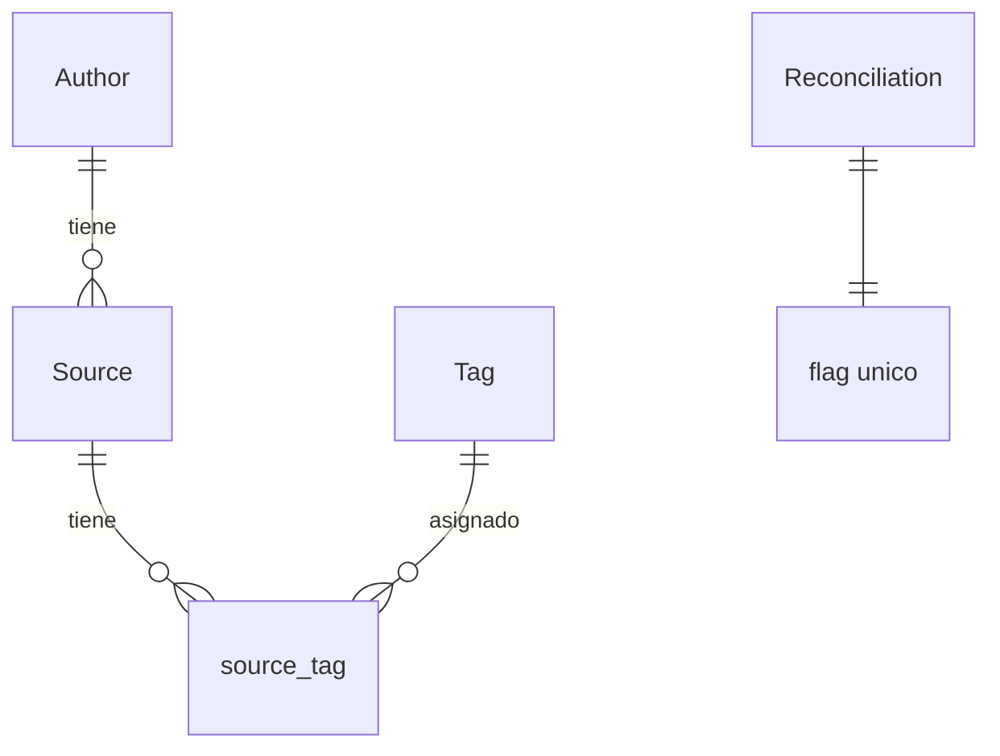

# api

## 1. Stack detallado de tecnologías y dependencias

### 1.1. Lenguaje y framework

| Capa      | Tecnología  | Versión | Notas                 |
|-----------|-------------|---------|-----------------------|
| Lenguaje  | Java        | 21      | LTS                   |
| Framework | Spring Boot | 4.1     | Parent en pom.xml     |
| Build     | Maven       | —       | Wrapper en `api/mvnw` |

### 1.2. Dependencias de producción

| Dependencia                      | Propósito                                    |
|----------------------------------|----------------------------------------------|
| `spring-boot-starter-web`        | Controladores REST, Jackson, Tomcat embebido |
| `spring-boot-starter-data-jpa`   | JPA + Hibernate + Spring Data                |
| `spring-boot-starter-validation` | Bean Validation (`@Valid`)                   |
| `flyway-core`                    | Migraciones de esquema                       |
| `flyway-database-postgresql`     | Soporte PostgreSQL en Flyway                 |
| `postgresql`                     | Driver JDBC de PostgreSQL (runtime)          |

### 1.3. Base de datos

| Propiedad | Valor              |
|-----------|--------------------|
| Motor     | PostgreSQL         |
| Versión   | *(por determinar)* |

### 1.4. Testing (por definir)

## 2. Endpoints

### 2.1. Sources

| Método   | Ruta                     | Propósito                                                                | Consumidor |
|----------|--------------------------|--------------------------------------------------------------------------|------------|
| `GET`    | `/api/sources`           | Listar / buscar sources con paginación                                   | Frontend   |
| `GET`    | `/api/sources/{id}`      | Obtener detalle de un source                                             | Frontend   |
| `PATCH`  | `/api/sources/{id}`      | Editar metadatos (year, edition, url)                                    | Frontend   |
| `DELETE` | `/api/sources/{id}`      | Purgar un orphan source (permanente)                                     | Frontend   |
| `GET`    | `/api/sources/paths`     | Obtener estado conocido de todos los sources para reconciliación         | Agent      |
| `POST`   | `/api/sources/reconcile` | Enviar batch de operaciones (CREATE, RENAME, UPDATE, DELETE, REACTIVATE) | Agent      |

---

#### `GET /api/sources`

Lista paginada de sources con filtros.

**Query parameters:**

| Parámetro        | Tipo      | Default    | Descripción                                  |
|------------------|-----------|------------|----------------------------------------------|
| `q`              | `string`  | —          | Búsqueda por nombre, autor, url              |
| `authorId`       | `UUID`    | —          | Filtrar por autor                            |
| `tagId`          | `UUID`    | —          | Filtrar por tag                              |
| `format`         | `string`  | —          | Filtrar por formato (`PDF`, `EPUB`, `MHTML`) |
| `includeDeleted` | `boolean` | `false`    | Incluir orphan sources                       |
| `page`           | `int`     | `0`        | Página (0-indexed)                           |
| `size`           | `int`     | `20`       | Tamaño de página (máx. 100)                  |
| `sort`           | `string`  | `name,asc` | Campo y dirección de ordenamiento            |

**Response `200 OK`:**

```json
{
  "content": [
    {
      "id": "550e8400-e29b-41d4-a716-446655440000",
      "name": "cien-anios.pdf",
      "path": "Gabriel García Márquez/cien-anios.pdf",
      "fileFormat": "PDF",
      "author": {
        "id": "uuid",
        "name": "Gabriel García Márquez"
      },
      "tags": [
        {
          "id": "uuid",
          "name": "favorito"
        }
      ],
      "year": null,
      "edition": null,
      "url": null,
      "createdAt": "2026-07-01T12:00:00Z",
      "updatedAt": "2026-07-01T12:00:00Z",
      "deletedAt": null
    }
  ],
  "page": 0,
  "size": 20,
  "totalElements": 1,
  "totalPages": 1
}
```

---

#### `GET /api/sources/{id}`

Detalle de un source.

**Path parameter:** `id` — UUID del source.

**Query parameters:**

| Parámetro        | Tipo      | Default | Descripción                       |
|------------------|-----------|---------|-----------------------------------|
| `includeDeleted` | `boolean` | `false` | Permitir consultar orphan sources |

**Response `200 OK`:** Misma estructura que un item del array en `GET /api/sources`.

**Errors:** `404` — source no encontrado.

---

#### `PATCH /api/sources/{id}`

Actualiza metadatos editables. Solo actualiza los campos enviados (merge parcial).

**Path parameter:** `id` — UUID del source.

**Request body:**

```json
{
  "year": 1967,
  "edition": "1ª edición",
  "url": "https://example.com/libro"
}
```

| Campo     | Tipo            | Requerido | Descripción                                                            |
|-----------|-----------------|-----------|------------------------------------------------------------------------|
| `year`    | `integer`       | no        | Año de publicación. `null` limpia el valor                             |
| `edition` | `string` (50)   | no        | Edición. `null` limpia el valor                                        |
| `url`     | `string` (2048) | no        | URL asociada. Debe ser HTTP/HTTPS si se provee. `null` limpia el valor |

**Response `200 OK`:** Source actualizado (misma estructura que un item de listado).

**Errors:** `400` — url inválida, año fuera de rango. `404` — source no encontrado.

---

#### `DELETE /api/sources/{id}`

Purga físicamente un orphan source. **Irreversible.** Solo permite purgar sources con `deleted_at ≠ null`.

**Path parameter:** `id` — UUID del source.

**Response:** `204 No Content` — sin cuerpo.

**Errors:** `404` — source no encontrado. `409` — source activo (`deleted_at IS NULL`). Debe eliminarse del FS primero.

---

#### `GET /api/sources/paths`

Devuelve el estado conocido de todos los sources para que el Agent ejecute la reconciliación.

**Response `200 OK`:**

```json
[
  {
    "id": "550e8400-e29b-41d4-a716-446655440000",
    "path": "Gabriel García Márquez/cien-anios.pdf",
    "pathLower": "gabriel garcía márquez/cien-anios.pdf",
    "contentHash": "e3b0c44298fc1c149afbf4c8996fb92427ae41e4649b934ca495991b7852b855",
    "deletedAt": null
  }
]
```

**Respuesta plana** (sin paginación) — el Agent necesita el conjunto completo para clasificar contra el FS.

**Errores:** ningún código de error específico. El Agent reintenta ante fallo de conexión.

---

#### `POST /api/sources/reconcile`

Procesa un batch de operaciones enviadas por el Agent. Idempotente: operaciones duplicadas se manejan como no-op.

**Request body:**

```json
{
  "operations": [
    {
      "type": "CREATE",
      "name": "Cien años de soledad.pdf",
      "path": "Gabriel García Márquez/Cien años de soledad.pdf",
      "pathLower": "gabriel garcía márquez/cien años de soledad.pdf",
      "contentHash": "e3b0c44298fc1c149afbf4c8996fb92427ae41e4649b934ca495991b7852b855",
      "fileFormat": "PDF",
      "authorName": "Gabriel García Márquez"
    },
    {
      "type": "RENAME",
      "sourceId": "550e8400-e29b-41d4-a716-446655440000",
      "name": "Cien años de soledad.pdf",
      "path": "Gabriel García Márquez/Cien años de soledad.pdf",
      "pathLower": "gabriel garcía márquez/cien años de soledad.pdf",
      "fileFormat": "PDF",
      "authorName": "Gabriel García Márquez"
    },
    {
      "type": "UPDATE",
      "sourceId": "550e8400-e29b-41d4-a716-446655440002",
      "contentHash": "01ba4719c80b6fe911b091a7c05124b64eeece964e09c058ef8f9805daca546b"
    },
    {
      "type": "DELETE",
      "sourceId": "550e8400-e29b-41d4-a716-446655440003"
    },
    {
      "type": "REACTIVATE",
      "sourceId": "550e8400-e29b-41d4-a716-446655440004",
      "path": "Gabriel García Márquez/reactivado.pdf",
      "contentHash": "e3b0c44298fc1c149afbf4c8996fb92427ae41e4649b934ca495991b7852b855"
    }
  ]
}
```

**Campos requeridos por tipo de operación:**

| Tipo         | `type` | `sourceId` | `name` | `path`   | `pathLower` | `contentHash` | `fileFormat` | `authorName` |
|--------------|--------|------------|--------|----------|-------------|---------------|--------------|--------------|
| `CREATE`     | ✓      | —          | ✓      | ✓        | ✓           | ✓             | ✓            | opcional     |
| `RENAME`     | ✓      | ✓          | ✓      | ✓        | ✓           | —             | ✓            | opcional     |
| `UPDATE`     | ✓      | ✓          | —      | —        | —           | ✓             | —            | —            |
| `DELETE`     | ✓      | ✓          | —      | opcional | —           | —             | —            | —            |
| `REACTIVATE` | ✓      | ✓          | —      | ✓        | —           | ✓             | —            | —            |

**Response `200 OK`:**

```json
{
  "processed": 5,
  "created": 1,
  "renamed": 1,
  "updated": 1,
  "deleted": 1,
  "reactivated": 1,
  "errors": [
    {
      "type": "CREATE",
      "path": "error.pdf",
      "error": "UNSUPPORTED_FORMAT"
    }
  ]
}
```

**Reglas de ordenamiento:** El Agent envía las operaciones en el orden RENAME → UPDATE → REACTIVATE → CREATE → DELETE.
La API procesa secuencialmente en el orden del array. Cada operación ve el estado resultante de la anterior.

**Errores individuales:** La API responde siempre `200` con errores por operación en el array `errors`. El Agent decide
si reintentar. Excepciones: `4xx` (excluyendo `409`) no reintentar; `409` reintentar 1 vez; `5xx` reintentar con backoff
configurable.

**Reglas de procesamiento:**

- **CREATE**: busca o crea el autor por `authorName`. Inserta el source. Si el path_lower ya existe activo, responde
  `409` en `errors`.
- **RENAME**: actualiza path y pathLower del source identificado por `sourceId`. Re-infere el autor si se envía
  `authorName`. Si el source estaba soft-deleteado, lo reactiva automáticamente.
- **UPDATE**: actualiza `contentHash` del source identificado por `sourceId`. No modifica otros campos.
- **DELETE**: aplica soft-delete (setea `deleted_at = now()`) al source identificado por `sourceId`. Idempotente: si ya
  estaba soft-deleteado, es no-op.
- **REACTIVATE**: limpia `deleted_at` del source identificado por `sourceId`. Actualiza path y contentHash. Preserva
  metadatos existentes.

---

### 2.2. Authors

| Método | Ruta           | Propósito      | Consumidor |
|--------|----------------|----------------|------------|
| `GET`  | `/api/authors` | Listar autores | Frontend   |

---

#### `GET /api/authors`

**Query parameters:**

| Parámetro | Tipo     | Default | Descripción                                     |
|-----------|----------|---------|-------------------------------------------------|
| `q`       | `string` | —       | Búsqueda por nombre (parcial, case-insensitive) |

**Response `200 OK`:**

```json
[
  {
    "id": "550e8400-e29b-41d4-a716-446655440000",
    "name": "Gabriel García Márquez"
  }
]
```

---

### 2.3. Tags

| Método   | Ruta             | Propósito     | Consumidor |
|----------|------------------|---------------|------------|
| `GET`    | `/api/tags`      | Listar tags   | Frontend   |
| `POST`   | `/api/tags`      | Crear tag     | Frontend   |
| `PATCH`  | `/api/tags/{id}` | Renombrar tag | Frontend   |
| `DELETE` | `/api/tags/{id}` | Eliminar tag  | Frontend   |

---

#### `GET /api/tags`

**Query parameters:**

| Parámetro | Tipo     | Default | Descripción                                     |
|-----------|----------|---------|-------------------------------------------------|
| `q`       | `string` | —       | Búsqueda por nombre (parcial, case-insensitive) |

**Response `200 OK`:**

```json
[
  {
    "id": "550e8400-e29b-41d4-a716-446655440000",
    "name": "favorito"
  }
]
```

---

#### `POST /api/tags`

**Request body:**

```json
{
  "name": "ciencia-ficcion"
}
```

| Campo  | Tipo           | Requerido | Descripción                                     |
|--------|----------------|-----------|-------------------------------------------------|
| `name` | `string` (255) | sí        | Nombre del tag. Se normaliza a lowercase. Único |

**Response `201 Created`:** Tag creado.

**Errors:** `400` — name vacío o inválido. `409` — tag ya existe.

---

#### `PATCH /api/tags/{id}`

**Path parameter:** `id` — UUID del tag.

**Request body:**

```json
{
  "name": " ciencia ficcion "
}
```

| Campo  | Tipo           | Requerido | Descripción                                          |
|--------|----------------|-----------|------------------------------------------------------|
| `name` | `string` (255) | sí        | Nuevo nombre. Se normaliza (trim + lowercase). Único |

**Response `200 OK`:** Tag actualizado.

**Errors:** `404` — tag no encontrado. `409` — nombre ya existe.

---

#### `DELETE /api/tags/{id}`

**Path parameter:** `id` — UUID del tag.

**Response:** `204 No Content`.

**Errors:** `404` — tag no encontrado.

**Nota:** La eliminación de un tag desasocia todos los source_tags automáticamente vía `ON DELETE CASCADE`.

---

### 2.4. Tags en sources

| Método | Ruta                     | Propósito                    | Consumidor |
|--------|--------------------------|------------------------------|------------|
| `PUT`  | `/api/sources/{id}/tags` | Reemplazar tags de un source | Frontend   |

---

#### `PUT /api/sources/{id}/tags`

Reemplaza **todas** las tags del source por la lista enviada. Idempotente.

**Path parameter:** `id` — UUID del source.

**Request body:**

```json
{
  "tagIds": [
    "550e8400-e29b-41d4-a716-446655440001",
    "550e8400-e29b-41d4-a716-446655440002"
  ]
}
```

| Campo    | Tipo     | Requerido | Descripción                                                          |
|----------|----------|-----------|----------------------------------------------------------------------|
| `tagIds` | `UUID[]` | sí        | Lista completa de IDs de tags a asignar. Array vacío desasigna todas |

**Response `200 OK`:** Source con tags actualizadas (misma estructura que un item de listado).

**Errors:** `404` — source o tag no encontrado.

---

### 2.5. Reconciliation

| Método | Ruta                     | Propósito                                     | Consumidor |
|--------|--------------------------|-----------------------------------------------|------------|
| `POST` | `/api/reconcile`         | Solicitar reconciliación manual               | Frontend   |
| `GET`  | `/api/reconcile/pending` | Consultar si hay reconciliación pendiente     | Agent      |
| `POST` | `/api/reconcile/ack`     | Confirmar que el Agent tomó la reconciliación | Agent      |

---

#### `POST /api/reconcile`

Solicita una reconciliación manual. Asíncrona: responde inmediatamente, el Agent la recoge por polling.

**Request body:** vacío.

**Response `200 OK`:**

```json
{
  "pending": true,
  "message": "Reconciliation pending."
}
```

---

#### `GET /api/reconcile/pending`

**Response `200 OK`:**

```json
{
  "pending": true
}
```

---

#### `POST /api/reconcile/ack`

Resetea el flag `pending` a `false`. El Agent lo llama inmediatamente antes de iniciar el escaneo.

**Request body:** vacío.

**Response `200 OK`:**

```json
{
  "acknowledged": true
}
```

## 3. Diseño de la API

### 3.1. Diagrama de capas

```
Controller   ← HTTP request/response, validación (@Valid), routing
    ↓
Service      ← Lógica de negocio, orquestación, @Transactional
    ↓
Repository   ← Acceso a datos (Spring Data JPA)
    ↓
Entity       ← Modelo de dominio (JPA @Entity)
```

**Reglas de dependencia:** cada capa solo depende de la inmediatamente inferior. Controller nunca accede a Repository.
Service nunca depende de Controller.

### 3.2. Estructura de paquetes

```
com.biblocat.api
├── ApiApplication.java
├── config/        ← Configuraciones Spring (CORS, JPA Auditing, Jackson)
├── controller/    ← Controladores REST (@RestController)
├── dto/
│   ├── request/   ← Objetos de entrada (CreateSourceRequest, etc.)
│   └── response/  ← Objetos de salida (SourceResponse, etc.)
├── entity/        ← Entidades JPA (Source, Author, Tag, etc.)
├── exception/     ← Excepciones de dominio + GlobalExceptionHandler
├── mapper/        ← Conversión Entity ↔ DTO
├── repository/    ← Interfaces Spring Data JPA
└── service/       ← Lógica de negocio (@Service)
```

### 3.3. Principios de diseño

- **La API no accede al filesystem.** Toda información del FS llega a través del Agent vía HTTP.
- **La API no se comunica con el Agent directamente.** El Agent es quien inicia toda comunicación. La API solo responde.
- **Toda mutación de sources del Agent pasa por `POST /api/sources/reconcile`.** No existe `POST /api/sources` ni
  `DELETE /api/sources` públicos para el Agent. Los endpoints individuales de sources son exclusivos del Frontend.
- **Soft-delete obligatorio.** No se eliminan registros físicamente salvo purge explícito del usuario.
- **DTOs separados de entities.** Las entidades JPA nunca se exponen directamente en la respuesta HTTP. Se mapean a
  DTOs.
- **Validación en la frontera.** Toda validación de entrada ocurre en el Controller vía `@Valid`. Service recibe datos
  ya validados.
- **Excepciones unchecked.** Todas las excepciones de dominio extienden `RuntimeException`. El `GlobalExceptionHandler`
  las traduce a respuestas HTTP con formato RFC 9457.

### 3.4. Patrones adoptados

| Patrón            | Implementación                                                                      |
|-------------------|-------------------------------------------------------------------------------------|
| DTO mapping       | Mapper manual o librería (entity ↔ DTO)                                             |
| Manejo de errores | `@RestControllerAdvice` + `ProblemDetail` (RFC 9457)                                |
| Validación        | `@Valid` + Bean Validation en Controllers                                           |
| Transacciones     | `@Transactional` en Services                                                        |
| Soft-delete       | `deleted_at IS NULL` en queries; `@Where(clause = "deleted_at IS NULL")` en entidad |
| Búsqueda dinámica | Spring Data JPA `Specification` o `@Query` con WHERE condicional                    |
| IDs               | UUID generados por la BD (`gen_random_uuid()`)                                      |

### 3.5. Paginación

## 4. Modelos

### 4.1. Diagrama entidad-relación



### 4.2. Entidades

#### Source (`sources`)

Entidad principal del sistema. Cada fila representa un archivo PDF, EPUB o MHTML descubierto en el filesystem. Los
metadatos editables por el usuario (año, edición, URL) se inicializan vacíos y se persisten independientemente del
estado del archivo en disco.

| Columna        | Tipo            | Constraints                              | Descripción                                                                                                                 |
|----------------|-----------------|------------------------------------------|-----------------------------------------------------------------------------------------------------------------------------|
| `id`           | `UUID`          | `PK`, `DEFAULT gen_random_uuid()`        | Identificador único                                                                                                         |
| `name`         | `VARCHAR(255)`  | `NOT NULL`                               | Nombre del archivo con extensión (ej: `cien-anios.pdf`)                                                                     |
| `path`         | `VARCHAR(1024)` | `NOT NULL`                               | Path relativo desde el directorio raíz, separadores `/` (ej: `Gabriel García Márquez/cien-anios.pdf`)                       |
| `path_lower`   | `VARCHAR(1024)` | `NOT NULL`                               | Path normalizado a lowercase para detección de duplicados y comparación case-insensitive. Ver nota sobre índice parcial     |
| `content_hash` | `VARCHAR(64)`   | `NOT NULL`                               | SHA-256 del contenido del archivo, representado como string hexadecimal de 64 caracteres. Ver nota sobre índice             |
| `file_format`  | `file_format`   | `NOT NULL`                               | Tipo de archivo. ENUM PostgreSQL: `'PDF'`, `'EPUB'`, `'MHTML'`                                                              |
| `author_id`    | `UUID`          | `FK → authors(id)`, `ON DELETE SET NULL` | Autor inferido de la carpeta padre inmediata dentro del directorio raíz. `NULL` si el archivo está en la raíz               |
| `year`         | `INTEGER`       |                                          | Año de publicación. Nullable, editable por el usuario                                                                       |
| `edition`      | `VARCHAR(50)`   |                                          | Edición del documento. Nullable, editable por el usuario                                                                    |
| `url`          | `VARCHAR(2048)` |                                          | URL asociada al documento. Nullable, editable por el usuario                                                                |
| `created_at`   | `TIMESTAMPTZ`   | `NOT NULL`, `DEFAULT now()`              | Fecha de creación del registro                                                                                              |
| `updated_at`   | `TIMESTAMPTZ`   | `NOT NULL`, `DEFAULT now()`              | Fecha de última modificación del registro                                                                                   |
| `deleted_at`   | `TIMESTAMPTZ`   |                                          | Soft-delete: `NULL` = source activo, `≠ NULL` = orphan source. Los metadatos se preservan mientras `deleted_at` tenga valor |

**Notas:**

- El índice `uq_sources_active_path_lower` es un índice único parcial sobre `path_lower WHERE deleted_at IS NULL`.
  Una unique constraint global impediría crear un source con el mismo path_lower que uno soft-deleteado.
- `content_hash` tiene un índice no único (`idx_sources_content_hash`) para acelerar la detección de renames
  (caso D de reconciliación). No es UNIQUE porque pueden coexistir duplicados temporales hasta que el Agent
  los resuelva como RENAME.
- `deleted_at = NULL` identifica sources activos. `deleted_at ≠ NULL` identifica orphan sources.
- `updated_at` se actualiza automáticamente desde JPA vía `@LastModifiedDate` + `@EnableJpaAuditing`.

#### Author (`authors`)

Autor inferido automáticamente por el Agent desde la carpeta padre del archivo dentro del directorio raíz. No se crean
ni editan manualmente desde la aplicación.

| Columna | Tipo           | Constraints                       | Descripción                                                                            |
|---------|----------------|-----------------------------------|----------------------------------------------------------------------------------------|
| `id`    | `UUID`         | `PK`, `DEFAULT gen_random_uuid()` | Identificador único                                                                    |
| `name`  | `VARCHAR(255)` | `NOT NULL`, `UNIQUE`              | Nombre del autor. Corresponde al nombre exacto de la carpeta padre (casing preservado) |

**Notas:**

- `ON DELETE SET NULL` en `sources.author_id` garantiza que si un author se elimina (no debería ocurrir en operación
  normal), los sources no se pierden — solo quedan sin autor.
- El Agent nunca envía el `id` del author. Envía `authorName` como string; la API busca por nombre existente o crea uno
  nuevo.

#### Tag (`tags`)

Etiquetas creadas y gestionadas por el usuario. Relación muchos a muchos con sources.

| Columna | Tipo           | Constraints                       | Descripción                                                            |
|---------|----------------|-----------------------------------|------------------------------------------------------------------------|
| `id`    | `UUID`         | `PK`, `DEFAULT gen_random_uuid()` | Identificador único                                                    |
| `name`  | `VARCHAR(255)` | `NOT NULL`, `UNIQUE`              | Nombre de la etiqueta (ej: `favorito`, `pendiente`, `ciencia-ficcion`) |

#### source_tag (`source_tags`)

Tabla de unión para la relación muchos a muchos entre sources y tags.

| Columna     | Tipo   | Constraints                                | Descripción          |
|-------------|--------|--------------------------------------------|----------------------|
| `source_id` | `UUID` | `PK`, `FK → sources(id) ON DELETE CASCADE` | Referencia al source |
| `tag_id`    | `UUID` | `PK`, `FK → tags(id) ON DELETE CASCADE`    | Referencia al tag    |

**Notas:**

- `ON DELETE CASCADE` en ambas FKs: si se purga un source o se elimina un tag, las asociaciones se limpian
  automáticamente.

#### Reconciliation (`reconciliation`)

Semáforo de un bit para señalizar reconciliaciones manuales entre el Frontend y el Agent. No es una entidad de dominio —
es un mecanismo de comunicación persistente.

| Columna      | Tipo          | Constraints                 | Descripción                                                                                     |
|--------------|---------------|-----------------------------|-------------------------------------------------------------------------------------------------|
| `id`         | `INTEGER`     | `PK`                        | Identificador único. La fila se inserta con `id = 1`. No se insertan más filas                  |
| `pending`    | `BOOLEAN`     | `NOT NULL`, `DEFAULT false` | `true` = el frontend solicitó una reconciliación manual pendiente de ser procesada por el Agent |
| `created_at` | `TIMESTAMPTZ` | `NOT NULL`, `DEFAULT now()` | Fecha de creación de la fila                                                                    |
| `updated_at` | `TIMESTAMPTZ` | `NOT NULL`, `DEFAULT now()` | Fecha de última modificación del flag                                                           |

**Notas:**

- La tabla contiene una única fila activa insertada al crear el esquema, con `id = 1`.
- El flujo completo: Frontend → `POST /api/reconcile` → API setea `pending = true` → Agent (polling) →
  `GET /api/reconcile/pending` → lee `true` → `POST /api/reconcile/ack` → API setea `pending = false` → Agent ejecuta
  escaneo.

## 5. Base de datos / Flyway

### 5.1. Migraciones

Convención de nombres: `V` + 4 dígitos + `__` + descripción en snake_case (ej: `V0001__initial_schema.sql`).
Solo migraciones versionadas (no repeatable). Nuevas columnas siempre nullable o con default (additive-only).

| Archivo                     | Descripción                                                                                                                                                                                             |
|-----------------------------|---------------------------------------------------------------------------------------------------------------------------------------------------------------------------------------------------------|
| `V0001__initial_schema.sql` | Crea el tipo ENUM `file_format`, las tablas `authors`, `sources`, `tags`, `source_tags` y `reconciliation` con sus columnas, constraints, FKs, índices, y el seed row de `reconciliation` con `id = 1`. |

## 6. Excepciones

La API utiliza el formato **RFC 9457**. En Spring Boot se activa mediante la propiedad
`spring.mvc.problemdetails.enabled=true`. Las respuestas de error usan `Content-Type: application/problem+json`.

### 6.1. Formato de respuesta

| Campo      | Tipo     | Descripción                                                                                     |
|------------|----------|-------------------------------------------------------------------------------------------------|
| `type`     | `URI`    | URL a la documentación del error. Ej: `"https://api.biblocat.local/errors/source-not-found"`    |
| `title`    | `string` | Resumen corto del error. Ej: `"Source Not Found"`                                               |
| `status`   | `int`    | Código HTTP                                                                                     |
| `detail`   | `string` | Mensaje específico de la ocurrencia. Ej: `"Source not found: /path/to/file.pdf"`                |
| `instance` | `URI`    | Path del request que generó el error. Ej: `"/api/sources/550e8400-e29b-41d4-a716-446655440000"` |

Ejemplo de respuesta `404`:

```json
{
  "type": "https://api.biblocat.local/errors/source-not-found",
  "title": "Source Not Found",
  "status": 404,
  "detail": "Source not found: /Gabriel García Márquez/cien-anios.pdf",
  "instance": "/api/sources/550e8400-e29b-41d4-a716-446655440000"
}
```

### 6.2. Tabla de excepciones

| Excepción               | HTTP | Disparo                        |
|-------------------------|------|--------------------------------|
| `Exception` (catch-all) | 500  | Cualquier error no contemplado |

## 7. Perfiles YAML

| Archivo                 | Propósito                                                                          |
|-------------------------|------------------------------------------------------------------------------------|
| `application.yaml`      | Configuración base compartida por todos los perfiles                               |
| `application-dev.yaml`  | Desarrollo local (logging verbose, base de datos local)                            |
| `application-prod.yaml` | Operación real (logging mínimo, base de datos productiva con variables de entorno) |

## 8. Testing
