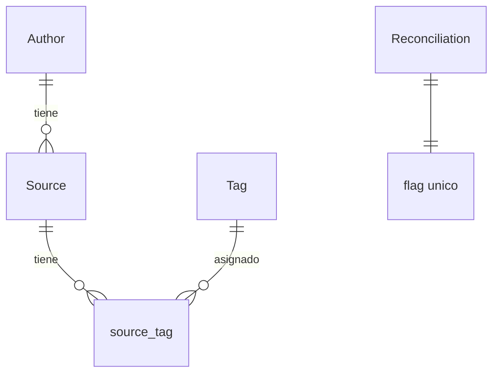

# api

## 1. Stack detallado de tecnologías y dependencias

### 1.1. Lenguaje y framework

| Capa      | Tecnología  | Versión | Notas                 |
|-----------|-------------|---------|-----------------------|
| Lenguaje  | Java        | 21      | LTS                   |
| Framework | Spring Boot | 4.1     | Parent en pom.xml     |
| Build     | Maven       | —       | Wrapper en `api/mvnw` |

### 1.2. Dependencias de producción

| Dependencia                      | Propósito                                    |
|----------------------------------|----------------------------------------------|
| `spring-boot-starter-web`        | Controladores REST, Jackson, Tomcat embebido |
| `spring-boot-starter-data-jpa`   | JPA + Hibernate + Spring Data                |
| `spring-boot-starter-validation` | Bean Validation (`@Valid`)                   |
| `spring-boot-starter-flyway`     | Migraciones Flyway + driver PostgreSQL       |
| `postgresql`                     | Driver JDBC de PostgreSQL (runtime)          |

### 1.3. Base de datos

| Propiedad                | Valor                                      |
|--------------------------|--------------------------------------------|
| Motor                    | PostgreSQL                                 |
| Versión                  | *(por determinar)*                         |
| Versión probada en tests | 16 (imagen `postgres:16-alpine`, ver §8.2) |

### 1.4. Testing

La estrategia de testing, dependencias y convenciones se definen en §8.

## 2. Endpoints

### 2.1. Sources

| Método   | Ruta                     | Propósito                                                                | Consumidor |
|----------|--------------------------|--------------------------------------------------------------------------|------------|
| `GET`    | `/api/sources`           | Listar / buscar sources con paginación                                   | Frontend   |
| `GET`    | `/api/sources/{id}`      | Obtener detalle de un source                                             | Frontend   |
| `PATCH`  | `/api/sources/{id}`      | Editar metadatos (year, edition, url)                                    | Frontend   |
| `DELETE` | `/api/sources/{id}`      | Purgar un orphan source (permanente)                                     | Frontend   |
| `GET`    | `/api/sources/paths`     | Obtener estado conocido de todos los sources para reconciliación         | Agent      |
| `POST`   | `/api/sources/reconcile` | Enviar batch de operaciones (CREATE, RENAME, UPDATE, DELETE, REACTIVATE) | Agent      |

---

#### `GET /api/sources`

Lista paginada de sources con filtros.

**Query parameters:**

| Parámetro        | Tipo      | Default    | Descripción                                                                                                      |
|------------------|-----------|------------|------------------------------------------------------------------------------------------------------------------|
| `q`              | `string`  | —          | Búsqueda parcial (case-insensitive) por nombre, autor, url; los caracteres `%`, `_` y `\` se buscan literalmente |
| `authorId`       | `UUID`    | —          | Filtrar por autor                                                                                                |
| `tagId`          | `UUID`    | —          | Filtrar por tag                                                                                                  |
| `format`         | `string`  | —          | Filtrar por formato (`PDF`, `EPUB`, `MHTML`)                                                                     |
| `includeDeleted` | `boolean` | `false`    | Incluir orphan sources                                                                                           |
| `page`           | `int`     | `0`        | Página (0-indexed)                                                                                               |
| `size`           | `int`     | `20`       | Tamaño de página (máx. 100)                                                                                      |
| `sort`           | `string`  | `name,asc` | Campo y dirección de ordenamiento                                                                                |

**Response `200 OK`:**

```json
{
  "content": [
    {
      "id": "550e8400-e29b-41d4-a716-446655440000",
      "name": "cien-anios.pdf",
      "path": "Gabriel García Márquez/cien-anios.pdf",
      "fileFormat": "PDF",
      "author": {
        "id": "uuid",
        "name": "Gabriel García Márquez"
      },
      "tags": [
        {
          "id": "uuid",
          "name": "favorito"
        }
      ],
      "createdAt": "2026-07-01T12:00:00Z",
      "updatedAt": "2026-07-01T12:00:00Z"
    }
  ],
  "page": 0,
  "size": 20,
  "totalElements": 1,
  "totalPages": 1
}
```

**Nota sobre nulos:** Los campos nulables (`year`, `edition`, `url`, `deletedAt`) se omiten de la respuesta JSON cuando
son `null`. El frontend debe tratar la ausencia del campo como `null`.

**Errors:**

| Código | Causa                                                                                                                                                   |
|--------|---------------------------------------------------------------------------------------------------------------------------------------------------------|
| `400`  | Parámetros de paginación inválidos (`page`/`size` no numéricos, `page` negativo, `size` < 1, `sort` con formato, campo o dirección inválidos). Ver §3.5 |

---

#### `GET /api/sources/{id}`

Detalle de un source.

**Path parameter:** `id` — UUID del source.

**Query parameters:**

| Parámetro        | Tipo      | Default | Descripción                       |
|------------------|-----------|---------|-----------------------------------|
| `includeDeleted` | `boolean` | `false` | Permitir consultar orphan sources |

**Response `200 OK`:** Misma estructura que un item del array en `GET /api/sources`.

**Errors:** `404` — source no encontrado.

---

#### `PATCH /api/sources/{id}`

Establece los metadatos editables del source. El frontend debe enviar los **tres campos** en cada
petición. No es merge parcial — los valores ausentes se interpretan como `null` y limpian el campo.

**Path parameter:** `id` — UUID del source.

**Request body:**

```json
{
  "year": 1967,
  "edition": "1ª edición",
  "url": "https://example.com/libro"
}
```

| Campo     | Tipo            | Requerido | Descripción                                                                                                                  |
|-----------|-----------------|-----------|------------------------------------------------------------------------------------------------------------------------------|
| `year`    | `integer`       | sí        | Año de publicación. `null` limpia el valor                                                                                   |
| `edition` | `string` (50)   | sí        | Edición. `null` limpia el valor                                                                                              |
| `url`     | `string` (2048) | sí        | URL asociada. Debe ser HTTP/HTTPS si se provee. `null` limpia el valor. No enviar string vacío (`""`) — se rechazará con 400 |

**Response `200 OK`:** Source actualizado (misma estructura que un item de listado).

**Errors:** `400` — url inválida, año fuera de rango. `404` — source no encontrado.

**Nota sobre orphans:** PATCH `/api/sources/{id}` y `PUT /api/sources/{id}/tags` operan también sobre orphan sources (soft-deleteados): los metadatos pueden editarse mientras el archivo no está en el FS. `GET` sin `includeDeleted=true` sigue excluyéndolos.

---

#### `DELETE /api/sources/{id}`

Purga físicamente un orphan source. **Irreversible.** Solo permite purgar sources con `deleted_at ≠ null`.

**Path parameter:** `id` — UUID del source.

**Response:** `204 No Content` — sin cuerpo.

**Errors:** `404` — source no encontrado. `409` — source activo (`deleted_at IS NULL`). Debe eliminarse del FS primero.

---

#### `GET /api/sources/paths`

Devuelve el estado conocido de todos los sources para que el Agent ejecute la reconciliación.

**Reglas de orden y unicidad:**

- Los sources activos (`deletedAt = null`) aparecen **antes** que los orphans (`deletedAt ≠ null`).
- Si dos sources comparten el mismo `pathLower`, el activo aparece primero y el orphan se omite
  de la respuesta. Esto evita ambigüedades durante la clasificación en el Agent (caso H de §2.5
  en `agent.md`).
- El Agent recibe un `pathLower` único por cada fila, sin necesidad de resolver conflictos.

**Response `200 OK`:**

```json
[
  {
    "id": "550e8400-e29b-41d4-a716-446655440000",
    "path": "Gabriel García Márquez/cien-anios.pdf",
    "pathLower": "gabriel garcía márquez/cien-anios.pdf",
    "contentHash": "e3b0c44298fc1c149afbf4c8996fb92427ae41e4649b934ca495991b7852b855"
  }
]
```

**Respuesta plana** (sin paginación) — el Agent necesita el conjunto completo para clasificar contra el FS.

**Garantía:** cada `pathLower` aparece como máximo una vez. Si hay un activo y un orphan con el
mismo `pathLower`, solo el activo se incluye.

**Errores:** ninguno específico. El Agent reintenta ante fallo de conexión.

---

#### `POST /api/sources/reconcile`

Procesa un batch de operaciones enviadas por el Agent. Idempotente: operaciones duplicadas se manejan como no-op.

**Request body:**

```json
{
  "operations": [
    {
      "type": "CREATE",
      "name": "Cien años de soledad.pdf",
      "path": "Gabriel García Márquez/Cien años de soledad.pdf",
      "pathLower": "gabriel garcía márquez/cien años de soledad.pdf",
      "contentHash": "e3b0c44298fc1c149afbf4c8996fb92427ae41e4649b934ca495991b7852b855",
      "fileFormat": "PDF",
      "authorName": "Gabriel García Márquez"
    },
    {
      "type": "RENAME",
      "sourceId": "550e8400-e29b-41d4-a716-446655440000",
      "name": "Cien años de soledad.pdf",
      "path": "Gabriel García Márquez/Cien años de soledad.pdf",
      "pathLower": "gabriel garcía márquez/cien años de soledad.pdf",
      "fileFormat": "PDF",
      "authorName": "Gabriel García Márquez"
    },
    {
      "type": "UPDATE",
      "sourceId": "550e8400-e29b-41d4-a716-446655440002",
      "contentHash": "01ba4719c80b6fe911b091a7c05124b64eeece964e09c058ef8f9805daca546b"
    },
    {
      "type": "DELETE",
      "sourceId": "550e8400-e29b-41d4-a716-446655440003"
    },
    {
      "type": "REACTIVATE",
      "sourceId": "550e8400-e29b-41d4-a716-446655440004",
      "path": "Gabriel García Márquez/reactivado.pdf",
      "contentHash": "e3b0c44298fc1c149afbf4c8996fb92427ae41e4649b934ca495991b7852b855"
    }
  ]
}
```

**Campos requeridos por tipo de operación:**

| Tipo         | `type` | `sourceId` | `name` | `path`   | `pathLower` | `contentHash` | `fileFormat` | `authorName` |
|--------------|--------|------------|--------|----------|-------------|---------------|--------------|--------------|
| `CREATE`     | ✓      | —          | ✓      | ✓        | ✓           | ✓             | ✓            | opcional     |
| `RENAME`     | ✓      | ✓          | ✓      | ✓        | ✓           | —             | ✓            | opcional     |
| `UPDATE`     | ✓      | ✓          | —      | —        | —           | ✓             | —            | —            |
| `DELETE`     | ✓      | ✓          | —      | opcional | —           | —             | —            | —            |
| `REACTIVATE` | ✓      | ✓          | —      | ✓        | —           | ✓             | —            | —            |

`fileFormat` se valida en la API: un valor desconocido o ausente genera `UNSUPPORTED_FORMAT` por operación; el resto del batch continúa procesándose.

**Response `200 OK`:**

```json
{
  "processed": 5,
  "created": 1,
  "renamed": 1,
  "updated": 1,
  "deleted": 1,
  "reactivated": 1,
  "errors": [
    {
      "type": "CREATE",
      "path": "error.pdf",
      "error": "UNSUPPORTED_FORMAT"
    },
    {
      "type": "RENAME",
      "sourceId": "550e8400-e29b-41d4-a716-446655440099",
      "error": "SOURCE_NOT_FOUND"
    }
  ]
}
```

**Reglas de ordenamiento:** El Agent envía las operaciones en el orden RENAME → UPDATE → REACTIVATE → CREATE → DELETE.
La API agrupa las operaciones por `type` y procesa los grupos en ese orden canónico; el orden del array solo define el
orden dentro de cada grupo. Cada operación ve el estado resultante de las anteriores. Como el Agent ya envía las
operaciones agrupadas y ordenadas de esa forma, ambos enfoques producen el mismo resultado; el agrupamiento por tipo en
la API es una salvaguarda frente a batches desordenados.

**Nota sobre transferencia de metadatos:** La transferencia por `contentHash` en CREATE (Opción B, ver
`docs/issues/ISSUE-01-SafeSaveCrossFS.md`) busca orphans de escaneos anteriores. CREATE y DELETE en el mismo batch
no activan la transferencia porque el orphan aún no existe (DELETE se procesa después de CREATE).
Ver `agent.md §2.8.F EC32`.

**Errores individuales:** La API responde siempre `200` con errores por operación en el array `errors`. El Agent decide
si reintentar. Excepciones: `4xx` (excluyendo `409`) no reintentar; `409` reintentar 1 vez; `5xx` reintentar con backoff
configurable.

| Código de error        | Causa                                                                                | Acción del Agent                                          |
|------------------------|--------------------------------------------------------------------------------------|-----------------------------------------------------------|
| `MISSING_NAME`         | Operación CREATE/RENAME sin `name`                                                   | Log ERROR, no reintentar, revisar configuración del Agent |
| `MISSING_PATH`         | Operación CREATE/RENAME/REACTIVATE sin `path`                                        | Log ERROR, no reintentar, revisar configuración del Agent |
| `MISSING_PATH_LOWER`   | Operación CREATE/RENAME sin `pathLower`                                              | Log ERROR, no reintentar, revisar configuración del Agent |
| `MISSING_CONTENT_HASH` | Operación CREATE/UPDATE/REACTIVATE sin `contentHash`                                 | Log ERROR, no reintentar, revisar configuración del Agent |
| `MISSING_SOURCE_ID`    | Operación RENAME/UPDATE/DELETE/REACTIVATE sin `sourceId`                             | Log ERROR, no reintentar, revisar configuración del Agent |
| `SOURCE_NOT_FOUND`     | El `sourceId` no existe (fue purgado entre GET y POST)                               | Log WARN, no reintentar, continuar con el resto del batch |
| `UNSUPPORTED_FORMAT`   | Formato de archivo no soportado                                                      | Log WARN, no reintentar                                   |
| `DUPLICATE_PATH`       | `pathLower` ya existe como fuente activa (comprobado en CREATE, RENAME y REACTIVATE) | Log WARN, reintentar 1 vez                                |
| `DUPLICATE_AUTHOR`     | `authors.name` ya existe (race entre batches en CREATE)                              | Log WARN, reintentar 1 vez                                |

**Respaldo de unicidad:** si una operación viola el índice único parcial `uq_sources_active_path_lower` (p. ej. por una
race entre batches), la API traduce la violación a `DUPLICATE_PATH` en vez de un código interno. El chequeo depende del
nombre de la constraint; si una migración futura lo renombra, actualizar el mapeo en `SourceService.mapErrorCode`.

**Reglas de procesamiento:**

- **CREATE**: busca o crea el autor por `authorName`. Inserta el source. Si el path_lower ya existe activo, responde
  `409` en `errors`.
- **RENAME**: actualiza path y pathLower del source identificado por `sourceId`. Re-infere el autor si se envía
  `authorName`. Si el source estaba soft-deleteado, lo reactiva automáticamente.
  Si `sourceId` no existe, responde `SOURCE_NOT_FOUND` en `errors`.
  Si el nuevo `pathLower` ya existe activo en otro source, responde `DUPLICATE_PATH` en `errors`.
- **UPDATE**: actualiza `contentHash` del source identificado por `sourceId`. No modifica otros campos.
  Si `sourceId` no existe, responde `SOURCE_NOT_FOUND` en `errors`.
- **DELETE**: aplica soft-delete (setea `deleted_at = now()`) al source identificado por `sourceId`. Idempotente: si ya
  estaba soft-deleteado, es no-op.
  Si `sourceId` no existe, responde `SOURCE_NOT_FOUND` en `errors`.
- **REACTIVATE**: limpia `deleted_at` del source identificado por `sourceId`. Actualiza path y contentHash. Preserva
  metadatos existentes. Si el `pathLower` del source a reactivar ya pertenece a otro source activo, responde
  `DUPLICATE_PATH` y no lo reactiva.
  Si `sourceId` no existe, responde `SOURCE_NOT_FOUND` en `errors`.
  **Nota:** REACTIVATE no modifica `pathLower`. El caso B de clasificación (`agent.md §2.5`) requiere que el path
  exista en la API, por lo que el path no cambia respecto al estado conocido. Si el path hubiera cambiado, el Agent
  clasificaría como RENAME (caso D), no como REACTIVATE.

---

### 2.2. Authors

| Método | Ruta           | Propósito      | Consumidor |
|--------|----------------|----------------|------------|
| `GET`  | `/api/authors` | Listar autores | Frontend   |

---

#### `GET /api/authors`

**Query parameters:**

| Parámetro | Tipo     | Default | Descripción                                     |
|-----------|----------|---------|-------------------------------------------------|
| `q`       | `string` | —       | Búsqueda por nombre (parcial, case-insensitive) |

**Response `200 OK`:**

```json
[
  {
    "id": "550e8400-e29b-41d4-a716-446655440000",
    "name": "Gabriel García Márquez"
  }
]
```

---

### 2.3. Tags

| Método   | Ruta             | Propósito     | Consumidor |
|----------|------------------|---------------|------------|
| `GET`    | `/api/tags`      | Listar tags   | Frontend   |
| `POST`   | `/api/tags`      | Crear tag     | Frontend   |
| `PATCH`  | `/api/tags/{id}` | Renombrar tag | Frontend   |
| `DELETE` | `/api/tags/{id}` | Eliminar tag  | Frontend   |

---

#### `GET /api/tags`

**Query parameters:**

| Parámetro | Tipo     | Default | Descripción                                     |
|-----------|----------|---------|-------------------------------------------------|
| `q`       | `string` | —       | Búsqueda por nombre (parcial, case-insensitive) |

**Response `200 OK`:**

```json
[
  {
    "id": "550e8400-e29b-41d4-a716-446655440000",
    "name": "favorito"
  }
]
```

---

#### `POST /api/tags`

**Request body:**

```json
{
  "name": "ciencia-ficcion"
}
```

| Campo  | Tipo           | Requerido | Descripción                                     |
|--------|----------------|-----------|-------------------------------------------------|
| `name` | `string` (255) | sí        | Nombre del tag. Se normaliza a lowercase. Único |

**Response `201 Created`:** Tag creado.

**Errors:** `400` — name vacío o inválido. `409` — tag ya existe.

---

#### `PATCH /api/tags/{id}`

**Path parameter:** `id` — UUID del tag.

**Request body:**

```json
{
  "name": " ciencia ficcion "
}
```

| Campo  | Tipo           | Requerido | Descripción                                          |
|--------|----------------|-----------|------------------------------------------------------|
| `name` | `string` (255) | sí        | Nuevo nombre. Se normaliza (trim + lowercase). Único |

**Response `200 OK`:** Tag actualizado.

**Errors:** `404` — tag no encontrado. `409` — nombre ya existe.

---

#### `DELETE /api/tags/{id}`

**Path parameter:** `id` — UUID del tag.

**Response:** `204 No Content`.

**Errors:** `404` — tag no encontrado.

**Nota:** La eliminación de un tag desasocia todos los source_tags automáticamente vía `ON DELETE CASCADE`.

---

### 2.4. Tags en sources

| Método | Ruta                     | Propósito                    | Consumidor |
|--------|--------------------------|------------------------------|------------|
| `PUT`  | `/api/sources/{id}/tags` | Reemplazar tags de un source | Frontend   |

---

#### `PUT /api/sources/{id}/tags`

Reemplaza **todas** las tags del source por la lista enviada. Idempotente.

**Path parameter:** `id` — UUID del source.

**Request body:**

```json
{
  "tagIds": [
    "550e8400-e29b-41d4-a716-446655440001",
    "550e8400-e29b-41d4-a716-446655440002"
  ]
}
```

| Campo    | Tipo     | Requerido | Descripción                                                          |
|----------|----------|-----------|----------------------------------------------------------------------|
| `tagIds` | `UUID[]` | sí        | Lista completa de IDs de tags a asignar. Array vacío desasigna todas |

**Response `200 OK`:** Source con tags actualizadas (misma estructura que un item de listado).

**Errors:** `404` — source o tag no encontrado.

---

### 2.5. Reconciliation

| Método | Ruta                     | Propósito                                     | Consumidor |
|--------|--------------------------|-----------------------------------------------|------------|
| `POST` | `/api/reconcile`         | Solicitar reconciliación manual               | Frontend   |
| `GET`  | `/api/reconcile/pending` | Consultar si hay reconciliación pendiente     | Agent      |
| `POST` | `/api/reconcile/ack`     | Confirmar que el Agent tomó la reconciliación | Agent      |

---

#### `POST /api/reconcile`

Solicita una reconciliación manual. Asíncrona: responde inmediatamente, el Agent la recoge por polling.

**Request body:** vacío.

**Comportamiento:** Idempotente. Si `pending` ya es `true`, la API responde `200` con el mismo cuerpo
(sin error). Esto cubre doble clic del usuario o múltiples solicitudes simultáneas desde el frontend.

**Response `200 OK`:**

```json
{
  "pending": true,
  "message": "Reconciliation pending."
}
```

**Errors:** No genera errores HTTP. Siempre responde `200`.

**Nota sobre race condition:** Existe una ventana donde el Agent llama a `POST /api/reconcile/ack`
(que resetea `pending` a `false`) concurrentemente con una nueva solicitud del frontend. En ese caso,
la solicitud del frontend es idempotente (responde `200`) pero el ack la invalida inmediatamente.
El próximo poll del Agent no verá `pending=true`. El usuario debe reintentar. Ver `agent.md §2.8.F EC43`.

---

#### `GET /api/reconcile/pending`

**Response `200 OK`:**

```json
{
  "pending": true
}
```

---

#### `POST /api/reconcile/ack`

Resetea el flag `pending` a `false`. El Agent lo llama inmediatamente antes de iniciar el escaneo.

**Request body:** vacío.

**Response `200 OK`:**

```json
{
  "acknowledged": true
}
```

**Nota:** El Agent también llama a este endpoint al iniciar para limpiar flags huérfanos de un crash anterior
(ver `agent.md §2.8.F EC44`). Es seguro llamarlo en cualquier momento — si `pending` ya es `false`, es no-op.

## 3. Diseño de la API

### 3.1. Diagrama de capas

```
Controller   ← HTTP request/response, validación (@Valid), routing
    ↓
Service      ← Lógica de negocio, orquestación, @Transactional
    ↓
Repository   ← Acceso a datos (Spring Data JPA)
    ↓
Entity       ← Modelo de dominio (JPA @Entity)
```

**Reglas de dependencia:** cada capa solo depende de la inmediatamente inferior. Controller nunca accede a Repository.
Service nunca depende de Controller.

### 3.2. Estructura de paquetes

```
com.biblocat.api
├── ApiApplication.java
├── config/        ← Configuraciones Spring (CORS, JPA Auditing). Jackson se configura vía YAML
├── controller/    ← Controladores REST (@RestController)
├── dto/
│   ├── request/   ← Objetos de entrada (CreateSourceRequest, etc.)
│   └── response/  ← Objetos de salida (SourceResponse, etc.)
├── entity/        ← Entidades JPA (Source, Author, Tag, etc.)
├── exception/     ← Excepciones de dominio + GlobalExceptionHandler
├── mapper/        ← Conversión Entity ↔ DTO
├── repository/    ← Interfaces Spring Data JPA
└── service/       ← Lógica de negocio (@Service)
```

### 3.3. Principios de diseño

- **La API no accede al filesystem.** Toda información del FS llega a través del Agent vía HTTP.
- **La API no se comunica con el Agent directamente.** El Agent es quien inicia toda comunicación. La API solo responde.
- **Toda mutación de sources del Agent pasa por `POST /api/sources/reconcile`.** No existe `POST /api/sources` ni
  `DELETE /api/sources` públicos para el Agent. Los endpoints individuales de sources son exclusivos del Frontend.
- **Soft-delete obligatorio.** No se eliminan registros físicamente salvo purge explícito del usuario.
- **DTOs separados de entities.** Las entidades JPA nunca se exponen directamente en la respuesta HTTP. Se mapean a
  DTOs.
- **Validación en la frontera.** Toda validación expresable con Bean Validation estándar (formato de campos, tipos,
  `@NotNull` en campos no condicionales) ocurre en el Controller vía `@Valid`. La validación de campos requeridos
  condicionales (según el tipo de operación en `POST /api/sources/reconcile`) ocurre en el Service, donde se evalúa
  programáticamente antes de persistir.
- **Excepciones unchecked.** Todas las excepciones de dominio extienden `RuntimeException`. El `GlobalExceptionHandler`
  las traduce a respuestas HTTP con formato RFC 9457.

### 3.4. Patrones adoptados

| Patrón            | Implementación                                                                                                                                                                                                                      |
|-------------------|-------------------------------------------------------------------------------------------------------------------------------------------------------------------------------------------------------------------------------------|
| DTO mapping       | Mapper manual o librería (entity ↔ DTO)                                                                                                                                                                                             |
| Manejo de errores | `@RestControllerAdvice` + `ProblemDetail` (RFC 9457)                                                                                                                                                                                |
| Validación        | `@Valid` + Bean Validation en Controllers                                                                                                                                                                                           |
| Transacciones     | `@Transactional` en Services                                                                                                                                                                                                        |
| Soft-delete       | `deleted_at IS NULL` en queries explícitas vía `SourceSpecifications` (Criteria) y native queries en `SourceRepository`. Sin `@Where`/`@SQLRestriction` en la entidad para permitir consultar orphans cuando `includeDeleted=true`. |
| Búsqueda dinámica | Spring Data JPA `Specification` o `@Query` con WHERE condicional                                                                                                                                                                    |
| IDs               | UUID generados por Hibernate vía `GenerationType.UUID` (`UUID.randomUUID()` en Java)                                                                                                                                                |

### 3.5. Paginación

#### 3.5.1. Estilo

Paginación **offset-based** con los parámetros `page`, `size` y `sort` (Spring Data `Pageable`).
No se utiliza cursor/keyset. La página inicial es `0` (0-indexed).

#### 3.5.2. Convención de query parameters

| Parámetro | Tipo     | Default    | Reglas                                                                                                                                                                                                                                                                                                                                             |
|-----------|----------|------------|----------------------------------------------------------------------------------------------------------------------------------------------------------------------------------------------------------------------------------------------------------------------------------------------------------------------------------------------------|
| `page`    | `int`    | `0`        | Página 0-indexed. Valor negativo o no numérico → `400`                                                                                                                                                                                                                                                                                             |
| `size`    | `int`    | `20`       | Tamaño de página, mínimo 1. `size` no numérico o menor que 1 → `400`. Mayores a 100 se limitan silenciosamente a 100 (**clamp**, no es error)                                                                                                                                                                                                      |
| `sort`    | `string` | `name,asc` | Formato `campo[,direccion]`, dirección `asc`/`desc` (case-insensitive) como último token separado por coma. Criterios múltiples: parámetros `sort` repetidos (ej. `sort=name,asc&sort=createdAt,desc`) o `sort=campo1,campo2,direccion` (dirección única al final). No se soporta el separador `:` (→ `400`). Cualquier token no permitido → `400` |

#### 3.5.3. Campos ordenables

Solo los siguientes campos pueden usarse en `sort`. Cualquier otro → `400`.

| Campo         | Notas                                                                                                                                                       |
|---------------|-------------------------------------------------------------------------------------------------------------------------------------------------------------|
| `name`        | Nombre del archivo                                                                                                                                          |
| `path`        | Path relativo                                                                                                                                               |
| `fileFormat`  | Formato (PDF, EPUB, MHTML)                                                                                                                                  |
| `year`        | Año de publicación                                                                                                                                          |
| `createdAt`   | Fecha de creación del registro                                                                                                                              |
| `updatedAt`   | Fecha de última modificación                                                                                                                                |
| `author.name` | Nombre del autor. Orden por LEFT JOIN con `authors`: los sources sin autor se incluyen; con PostgreSQL los nulls quedan al final en ASC y al inicio en DESC |

#### 3.5.4. Contrato de respuesta

Todo endpoint paginado responde con exactamente estos 5 campos:

| Campo           | Tipo    | Descripción                                                              |
|-----------------|---------|--------------------------------------------------------------------------|
| `content`       | `array` | Items de la página actual. Puede ser vacío si `page` excede `totalPages` |
| `page`          | `int`   | Número de página actual (0-indexed)                                      |
| `size`          | `int`   | Tamaño efectivo de página (con clamp aplicado)                           |
| `totalElements` | `int`   | Total de elementos tras aplicar los filtros                              |
| `totalPages`    | `int`   | `ceil(totalElements / size)`                                             |

No se exponen los campos adicionales de Spring Data (`pageable`, `sort`, `first`, `last`,
`numberOfElements`, `empty`).

#### 3.5.5. Errores y casos límite

| Caso                                         | Respuesta | Notas                                         |
|----------------------------------------------|-----------|-----------------------------------------------|
| `page`/`size` no numéricos o `page` < 0      | `400`     | Type mismatch (RFC 9457, ver §6)              |
| `size` no numérico o < 1                     | `400`     | Mínimo 1 (RFC 9457, ver §6)                   |
| `sort` con formato inválido (ej. `name:asc`) | `400`     | Separador `:` no soportado (RFC 9457, ver §6) |
| `sort` con campo fuera de la lista           | `400`     | Campo no ordenable                            |
| `sort` con dirección inválida                | `400`     | Solo `asc`/`desc`                             |
| `page` > `totalPages`                        | `200`     | `content: []`, no es error                    |

#### 3.5.6. Política por endpoint

| Endpoint                 | Paginación                | Motivo                                                    |
|--------------------------|---------------------------|-----------------------------------------------------------|
| `GET /api/sources`       | Sí (`page`/`size`/`sort`) | Único listado de alto volumen; consumido por el Frontend  |
| `GET /api/authors`       | No — array plano          | Bajo volumen; consumido como combos                       |
| `GET /api/tags`          | No — array plano          | Ídem                                                      |
| `GET /api/sources/paths` | No — array plano          | Por diseño: el Agent necesita el conjunto completo (§2.1) |

#### 3.5.7. Implementación de referencia

- Controller: `@PageableDefault(size = 20, sort = "name", direction = Sort.Direction.ASC) Pageable pageable`.
- Límites globales: `spring.data.web.pageable.default-page-size: 20` y
  `spring.data.web.pageable.max-page-size: 100` en `application.yaml`.
- Orden por `author.name` vía LEFT JOIN explícito en `SourcePaginationRepository` (los sources sin autor se incluyen).
- Validación estricta de `page`/`size`/`sort` en el controller (400 RFC 9457).
- El Frontend es el único consumidor de endpoints paginados (ver `front.md`).

## 4. Modelos

### 4.1. Diagrama entidad-relación


```mermaid
erDiagram
    Author ||--o{ Source: "tiene"
    Source ||--o{ source_tag: "tiene"
    Tag ||--o{ source_tag: "asignado"
    Reconciliation ||--|| "flag unico": ""
```

### 4.2. Entidades

#### Source (`sources`)

Entidad principal del sistema. Cada fila representa un archivo PDF, EPUB o MHTML descubierto en el filesystem. Los
metadatos editables por el usuario (año, edición, URL) se inicializan vacíos y se persisten independientemente del
estado del archivo en disco.

| Columna        | Tipo            | Constraints                              | Descripción                                                                                                                 |
|----------------|-----------------|------------------------------------------|-----------------------------------------------------------------------------------------------------------------------------|
| `id`           | `UUID`          | `PK`, `DEFAULT gen_random_uuid()`        | Identificador único                                                                                                         |
| `name`         | `VARCHAR(255)`  | `NOT NULL`                               | Nombre del archivo con extensión (ej: `cien-anios.pdf`)                                                                     |
| `path`         | `VARCHAR(1024)` | `NOT NULL`                               | Path relativo desde el directorio raíz, separadores `/` (ej: `Gabriel García Márquez/cien-anios.pdf`)                       |
| `path_lower`   | `VARCHAR(1024)` | `NOT NULL`                               | Path normalizado a lowercase para detección de duplicados y comparación case-insensitive. Ver nota sobre índice parcial     |
| `content_hash` | `VARCHAR(64)`   | `NOT NULL`                               | SHA-256 del contenido del archivo, representado como string hexadecimal de 64 caracteres. Ver nota sobre índice             |
| `file_format`  | `file_format`   | `NOT NULL`                               | Tipo de archivo. ENUM PostgreSQL: `'PDF'`, `'EPUB'`, `'MHTML'`                                                              |
| `author_id`    | `UUID`          | `FK → authors(id)`, `ON DELETE SET NULL` | Autor inferido de la carpeta padre inmediata dentro del directorio raíz. `NULL` si el archivo está en la raíz               |
| `year`         | `INTEGER`       |                                          | Año de publicación. Nullable, editable por el usuario                                                                       |
| `edition`      | `VARCHAR(50)`   |                                          | Edición del documento. Nullable, editable por el usuario                                                                    |
| `url`          | `VARCHAR(2048)` |                                          | URL asociada al documento. Nullable, editable por el usuario                                                                |
| `created_at`   | `TIMESTAMPTZ`   | `NOT NULL`, `DEFAULT now()`              | Fecha de creación del registro                                                                                              |
| `updated_at`   | `TIMESTAMPTZ`   | `NOT NULL`, `DEFAULT now()`              | Fecha de última modificación del registro                                                                                   |
| `deleted_at`   | `TIMESTAMPTZ`   |                                          | Soft-delete: `NULL` = source activo, `≠ NULL` = orphan source. Los metadatos se preservan mientras `deleted_at` tenga valor |

**Notas:**

- El índice `uq_sources_active_path_lower` es un índice único parcial sobre `path_lower WHERE deleted_at IS NULL`.
  Una unique constraint global impediría crear un source con el mismo path_lower que uno soft-deleteado.
- `content_hash` tiene un índice no único (`idx_sources_content_hash`) para acelerar la detección de renames
  (caso D de reconciliación). No es UNIQUE porque pueden coexistir duplicados temporales hasta que el Agent
  los resuelva como RENAME.
- `deleted_at = NULL` identifica sources activos. `deleted_at ≠ NULL` identifica orphan sources.
- `updated_at` se actualiza automáticamente desde Spring Data JPA vía `@LastModifiedDate`, habilitado por
  `@EnableJpaAuditing` en `JpaConfig`. `created_at` usa `@CreatedDate`. Ambas anotaciones son de Spring Data Auditing.

#### Author (`authors`)

Autor inferido automáticamente por el Agent desde la carpeta padre del archivo dentro del directorio raíz. No se crean
ni editan manualmente desde la aplicación.

| Columna | Tipo           | Constraints                       | Descripción                                                                            |
|---------|----------------|-----------------------------------|----------------------------------------------------------------------------------------|
| `id`    | `UUID`         | `PK`, `DEFAULT gen_random_uuid()` | Identificador único                                                                    |
| `name`  | `VARCHAR(255)` | `NOT NULL`, `UNIQUE`              | Nombre del autor. Corresponde al nombre exacto de la carpeta padre (casing preservado) |

**Notas:**

- `ON DELETE SET NULL` en `sources.author_id` garantiza que si un author se elimina (no debería ocurrir en operación
  normal), los sources no se pierden — solo quedan sin autor.
- El Agent nunca envía el `id` del author. Envía `authorName` como string; la API busca por nombre existente o crea uno
  nuevo.

#### Tag (`tags`)

Etiquetas creadas y gestionadas por el usuario. Relación muchos a muchos con sources.

| Columna | Tipo           | Constraints                       | Descripción                                                            |
|---------|----------------|-----------------------------------|------------------------------------------------------------------------|
| `id`    | `UUID`         | `PK`, `DEFAULT gen_random_uuid()` | Identificador único                                                    |
| `name`  | `VARCHAR(255)` | `NOT NULL`, `UNIQUE`              | Nombre de la etiqueta (ej: `favorito`, `pendiente`, `ciencia-ficcion`) |

#### source_tag (`source_tags`)

Tabla de unión para la relación muchos a muchos entre sources y tags.

| Columna     | Tipo   | Constraints                                | Descripción          |
|-------------|--------|--------------------------------------------|----------------------|
| `source_id` | `UUID` | `PK`, `FK → sources(id) ON DELETE CASCADE` | Referencia al source |
| `tag_id`    | `UUID` | `PK`, `FK → tags(id) ON DELETE CASCADE`    | Referencia al tag    |

**Notas:**

- `ON DELETE CASCADE` en ambas FKs: si se purga un source o se elimina un tag, las asociaciones se limpian
  automáticamente.

#### Reconciliation (`reconciliation`)

Semáforo de un bit para señalizar reconciliaciones manuales entre el Frontend y el Agent. No es una entidad de dominio —
es un mecanismo de comunicación persistente.

| Columna      | Tipo          | Constraints                 | Descripción                                                                                     |
|--------------|---------------|-----------------------------|-------------------------------------------------------------------------------------------------|
| `id`         | `INTEGER`     | `PK`                        | Identificador único. La fila se inserta con `id = 1`. No se insertan más filas                  |
| `pending`    | `BOOLEAN`     | `NOT NULL`, `DEFAULT false` | `true` = el frontend solicitó una reconciliación manual pendiente de ser procesada por el Agent |
| `created_at` | `TIMESTAMPTZ` | `NOT NULL`, `DEFAULT now()` | Fecha de creación de la fila                                                                    |
| `updated_at` | `TIMESTAMPTZ` | `NOT NULL`, `DEFAULT now()` | Fecha de última modificación del flag                                                           |

**Notas:**

- La tabla contiene una única fila activa insertada al crear el esquema, con `id = 1`.
- El flujo completo: Frontend → `POST /api/reconcile` → API setea `pending = true` → Agent (polling) →
  `GET /api/reconcile/pending` → lee `true` → `POST /api/reconcile/ack` → API setea `pending = false` → Agent ejecuta
  escaneo.

## 5. Base de datos / Flyway

### 5.1. Migraciones

Convención de nombres: `V` + 4 dígitos + `__` + descripción en snake_case (ej: `V0001__initial_schema.sql`).
Solo migraciones versionadas (no repeatable). Nuevas columnas siempre nullable o con default (additive-only).

| Archivo                     | Descripción                                                                                                                                                                                             |
|-----------------------------|---------------------------------------------------------------------------------------------------------------------------------------------------------------------------------------------------------|
| `V0001__initial_schema.sql` | Crea el tipo ENUM `file_format`, las tablas `authors`, `sources`, `tags`, `source_tags` y `reconciliation` con sus columnas, constraints, FKs, índices, y el seed row de `reconciliation` con `id = 1`. |

## 6. Excepciones

La API utiliza el formato **RFC 9457**. En Spring Boot se activa mediante la propiedad
`spring.mvc.problemdetails.enabled=true`. Las respuestas de error usan `Content-Type: application/problem+json`.

### 6.1. Formato de respuesta

| Campo      | Tipo     | Descripción                                                                                     |
|------------|----------|-------------------------------------------------------------------------------------------------|
| `type`     | `URI`    | URL a la documentación del error. Ej: `"https://api.biblocat.local/errors/source-not-found"`    |
| `title`    | `string` | Resumen corto del error. Ej: `"Source Not Found"`                                               |
| `status`   | `int`    | Código HTTP                                                                                     |
| `detail`   | `string` | Mensaje específico de la ocurrencia. Ej: `"Source not found: /path/to/file.pdf"`                |
| `instance` | `URI`    | Path del request que generó el error. Ej: `"/api/sources/550e8400-e29b-41d4-a716-446655440000"` |

Ejemplo de respuesta `404`:

```json
{
  "type": "https://api.biblocat.local/errors/source-not-found",
  "title": "Source Not Found",
  "status": 404,
  "detail": "Source not found: /Gabriel García Márquez/cien-anios.pdf",
  "instance": "/api/sources/550e8400-e29b-41d4-a716-446655440000"
}
```

### 6.2. Tabla de excepciones

| Excepción                             | HTTP | Disparo                                                                                                                                           |
|---------------------------------------|------|---------------------------------------------------------------------------------------------------------------------------------------------------|
| `SourceNotFoundException`             | 404  | Source no encontrado por ID                                                                                                                       |
| `TagNotFoundException`                | 404  | Tag no encontrado por ID                                                                                                                          |
| `ActiveSourceException`               | 409  | Intento de purgar un source activo (`deleted_at IS NULL`)                                                                                         |
| `TagAlreadyExistsException`           | 409  | Tag con ese nombre ya existe                                                                                                                      |
| `DuplicatePathException`              | 409  | `pathLower` ya existe como activo en `POST /api/sources/reconcile` (CREATE, RENAME, REACTIVATE)                                                   |
| `MethodArgumentNotValidException`     | 400  | Validación `@Valid` falla en cualquier endpoint                                                                                                   |
| `InvalidSortFieldException`           | 400  | `sort` con campo fuera de la whitelist (cualquier token que se asimila campo y no está en la whitelist)                                           |
| `InvalidPaginationParameterException` | 400  | `page`/`size` no numéricos o negativos, `size` < 1, separador `:` en `sort`, o dirección `asc`/`desc` colocada en una posición no final de `sort` |
| `Exception` (catch-all)               | 500  | Cualquier error no contemplado                                                                                                                    |

## 7. Perfiles YAML

| Archivo                 | Propósito                                                                          |
|-------------------------|------------------------------------------------------------------------------------|
| `application.yaml`      | Configuración base compartida por todos los perfiles                               |
| `application-dev.yaml`  | Desarrollo local (logging verbose, base de datos local)                            |
| `application-prod.yaml` | Operación real (logging mínimo, base de datos productiva con variables de entorno) |

## 8. Testing

### 8.1. Estrategia general

Pirámide adaptada al alcance del sistema, con **solo los tests mínimos e indispensables**: los **tests de
integración** son el núcleo (cubren el contrato HTTP completo y las reglas de dominio sobre PostgreSQL real) y los
**slice tests de web** cubren la validación de entrada y el mapeo de errores sin base de datos.

**Lo que NO se testea y por qué:**

- **Unit tests de servicios** — la lógica de negocio (validación condicional del reconcile, orden de procesamiento,
  transferencia por hash) se cubre por integración contra la BD real.
- **`@DataJpaTest` separado** — las specifications y queries nativas se ejercitan en los flujos de integración.
- **Mappers** — se cubren indirectamente por la serialización JSON verificada en cada endpoint.
- **Migraciones Flyway** — se validan en cada corrida de integración al levantarse el contexto sobre el contenedor.

**Decisiones adoptadas:**

| Decisión               | Opción adoptada                             | Justificación                                                                                                                                                              |
|------------------------|---------------------------------------------|----------------------------------------------------------------------------------------------------------------------------------------------------------------------------|
| Base de datos de tests | Testcontainers, imagen `postgres:16-alpine` | El esquema usa features de PostgreSQL (ENUM `file_format`, `gen_random_uuid()`, índice único parcial) que hacen inviable H2 con Flyway. Aislamiento total sin setup manual |
| API de asserts HTTP    | `MockMvcTester` + AssertJ                   | API recomendada en Spring Boot 4.1; fluida, tipada y encadenable                                                                                                           |
| Mocks en slice web     | `@MockitoBean`                              | Sustituto oficial de `@MockBean` (eliminado en Spring Boot 4.x)                                                                                                            |
| Niveles de testing     | Integración + slice web                     | Mínimo indispensable para cubrir contrato HTTP y reglas de dominio                                                                                                         |
| Versionado PostgreSQL  | `postgres:16-alpine`                        | Versión LTS; fija la versión probada en tests (§1.3)                                                                                                                       |

**Nota sobre Docker:** Testcontainers introduce Docker como **tooling de testing**, no como infraestructura de
producción. Ver `architecture.md §5.1`.

### 8.2. Stack de testing y dependencias

| Dependencia                                       | Propósito                                                                                                               | Scope |
|---------------------------------------------------|-------------------------------------------------------------------------------------------------------------------------|-------|
| `spring-boot-starter-test`                        | JUnit 5, Mockito, AssertJ, json-path (ya presente en el pom)                                                            | test  |
| `spring-boot-starter-webmvc-test`                 | Autoconfig de MVC para tests (`@WebMvcTest`, `@AutoConfigureMockMvc`) — en Boot 4.x ya no está incluido en starter-test | test  |
| `spring-boot-testcontainers`                      | Anotación `@ServiceConnection` (Spring Boot 4.1)                                                                        | test  |
| `org.testcontainers:testcontainers-junit-jupiter` | Integración JUnit 5                                                                                                     | test  |
| `org.testcontainers:testcontainers-postgresql`    | Contenedor PostgreSQL                                                                                                   | test  |

**Versionado de Testcontainers:** en Boot 4.1 la versión viene gestionada por el parent BOM vía la propiedad
`${testcontainers.version}` (= 2.0.5). Los BOM anidados del parent **no son transitivos** para `scope=import`
(MNG-5090), por lo que el `pom.xml` declara un `dependencyManagement` propio que importa `testcontainers-bom`
usando esa propiedad. No se hardcodea ninguna versión.

**ArtifactIds de Testcontainers 2.x:** los nombres clásicos de 1.x (`junit-jupiter`, `postgresql`) no existen;
el prefijo `testcontainers-` es obligatorio.

**Requisitos de entorno:**

- Docker Desktop en Windows (10/11). Sin Docker, la suite de integración no puede ejecutarse.
- La imagen `postgres:16-alpine` se descarga en la primera corrida.

**Comandos:**

| Comando                                        | Propósito                                        |
|------------------------------------------------|--------------------------------------------------|
| `./mvnw test` (desde `api/`)                   | Ejecutar toda la suite                           |
| `./mvnw test -Dgroups='!integration'`          | Ejecutar solo slice tests (sin Docker)           |

### 8.3. Niveles de testing

#### 8.3.1. Tests de integración (núcleo)

Cubren el contrato HTTP completo y las reglas de dominio sobre PostgreSQL real, incluyendo queries nativas,
soft-delete, el índice único parcial y la transferencia de metadatos por hash (§2.1, `docs/issues/ISSUE-01`).

**Configuración base:**

- Anotaciones: `@SpringBootTest` + `@AutoConfigureMockMvc` + `@Import(TestContainerConfig.class)`, donde
  `TestContainerConfig` es una `@TestConfiguration` que declara como bean con `@ServiceConnection` el
  `PostgreSQLContainer` del paquete modular `org.testcontainers.postgresql`, instanciado con
  `DockerImageName.parse("postgres:16-alpine")`. El alias `org.testcontainers.containers.PostgreSQLContainer`
  y el constructor con `String` están deprecados (desde Testcontainers 2.x y 1.15.0 respectivamente).
- Un único contenedor compartido por toda la suite (context caching de Spring; nunca un contenedor por clase).
- Flyway corre automáticamente sobre el contenedor al levantar el contexto.
- `MockMvcTester` se inyecta automáticamente con `@AutoConfigureMockMvc`.
- Clases anotadas con `@Tag("integration")` para poder excluirlas sin Docker.

**Limpieza de datos:**

- `@BeforeEach` con `DELETE` explícito en orden de FKs: `source_tags` → `sources` → `tags` → `authors`.
- La fila seed de `reconciliation` (`id = 1`, insertada por `V0001`) **se preserva**; se resetea con
  `UPDATE reconciliation SET pending = false` (el `DELETE` violaría el CHECK `id = 1`).
- Los estados que requieren metadatos (year/edition/url, tags, soft-delete, pathLower duplicado) se preparan
  directamente con `JdbcTemplate` (las queries nativas del dominio se ejercitan así igualmente).

**Factory de datos de prueba:**

- `TestDataFactory` centraliza los fixtures SQL que antes estaban duplicados en cada clase de test de
  integración: `insertSource`, `insertSourceWithMetadata`, `insertAuthor`, `insertTag`, `linkTag`,
  `softDelete` y las queries de verificación (`pathOf`, `contentHashOf`, `yearOf`, `editionOf`, `tagIdsOf`,
  etc.). Se declara como bean en `TestContainerConfig` y se inyecta como `data` en
  `AbstractPostgresIntegrationTest`, por lo que todas las clases hijas la usan vía `data.<metodo>(...)`.
  Los tests no escriben `INSERT`/`UPDATE` de datos propios fuera de la factory, salvo fixtures que la
  factory no soporta (p. ej. un source con `file_format = 'EPUB'` en `list_FiltroFormat`).

**Prohibiciones:**

- `@DirtiesContext` — invalida el context caching y ralentiza la suite.
- `@Transactional` en la clase de test — oculta el comportamiento real de commit y produce falsos positivos.

**Cobertura mínima indispensable por endpoint:**

| Endpoint                          | Casos indispensables                                                                                                                                                                                                                                                                                                                                                                                                                                                                                                                              |
|-----------------------------------|---------------------------------------------------------------------------------------------------------------------------------------------------------------------------------------------------------------------------------------------------------------------------------------------------------------------------------------------------------------------------------------------------------------------------------------------------------------------------------------------------------------------------------------------------|
| `POST /api/sources/reconcile`     | Batch con los 5 tipos de operación en un solo request; procesamiento en orden RENAME → UPDATE → REACTIVATE → CREATE → DELETE; DELETE repetido (idempotente, no-op); transferencia de metadatos por `contentHash` con 0, 1 y >1 orphans (§2.1, ISSUE-01); errores por operación: `MISSING_NAME`, `MISSING_PATH`, `MISSING_PATH_LOWER`, `MISSING_CONTENT_HASH`, `MISSING_SOURCE_ID`, `SOURCE_NOT_FOUND`, `UNSUPPORTED_FORMAT`, `DUPLICATE_PATH`; REACTIVATE preserva metadatos y no modifica `pathLower`; CREATE con `authorName` existente y nuevo |
| `GET /api/sources/paths`          | Sources activos antes que orphans; unicidad de `pathLower` (orphan omitido cuando un activo comparte pathLower); respuesta plana sin paginación                                                                                                                                                                                                                                                                                                                                                                                                   |
| `GET /api/sources`                | Filtros `q`/`authorId`/`tagId`/`format`; `includeDeleted`; clamp real de `size > 100` → `200` con `size = 100`; `page > totalPages` → `200` con `content: []`; orden por `author.name` con LEFT JOIN (sources sin autor incluidos); contrato exacto de 5 campos (sin `pageable`/`sort`/`first`/`last`)                                                                                                                                                                                                                                            |
| `GET /api/sources/{id}`           | `200`; `404`; `includeDeleted=true` permite consultar orphans                                                                                                                                                                                                                                                                                                                                                                                                                                                                                     |
| `PATCH /api/sources/{id}`         | `200` con los tres campos; `null` limpia el campo; URL inválida → `400`; `404`                                                                                                                                                                                                                                                                                                                                                                                                                                                                    |
| `DELETE /api/sources/{id}`        | `204` purga de orphan; `404`; `409` source activo                                                                                                                                                                                                                                                                                                                                                                                                                                                                                                 |
| `PUT /api/sources/{id}/tags`      | Reemplazo completo de tags; array vacío desasigna todas; `404` source; `404` tag                                                                                                                                                                                                                                                                                                                                                                                                                                                                  |
| `GET/POST/PATCH/DELETE /api/tags` | CRUD completo: `201`, `200`, `204`; `400` name vacío; `409` duplicado; `404`; normalización lowercase; DELETE con cascade de `source_tags`                                                                                                                                                                                                                                                                                                                                                                                                        |
| `GET /api/authors`                | Listado completo; búsqueda `q` parcial case-insensitive                                                                                                                                                                                                                                                                                                                                                                                                                                                                                           |
| `POST /api/reconcile`             | `200` con `pending: true`; idempotente (request repetido → `200` con el mismo cuerpo)                                                                                                                                                                                                                                                                                                                                                                                                                                                             |
| `GET /api/reconcile/pending`      | `200` con `pending` `true`/`false`                                                                                                                                                                                                                                                                                                                                                                                                                                                                                                                |
| `POST /api/reconcile/ack`         | `200` con `acknowledged: true`; no-op si `pending` ya es `false`                                                                                                                                                                                                                                                                                                                                                                                                                                                                                  |
| Formato RFC 9457                  | Verificación del formato completo (`type`/`title`/`status`/`detail`/`instance` + `Content-Type: application/problem+json`) en al menos un `400` y un `404` (§6)                                                                                                                                                                                                                                                                                                                                                                                   |

#### 8.3.2. Slice tests de web (contrato HTTP)

Verifican la capa web sin levantar la base de datos: validación de entrada, serialización JSON y mapeo de errores.

**Configuración base:**

- Anotaciones: `@WebMvcTest(ClaseController.class)` — carga solo el controller, su `@ControllerAdvice`
  (GlobalExceptionHandler) y la configuración MVC.
- Servicios mockeados con `@MockitoBean`.
- `MockMvcTester` se inyecta automáticamente.
- **No requieren Docker ni base de datos.**

**Clases:**

- `SourceControllerTest` — el más extenso: paginación, listado, detalle, patch, purge, paths, reconcile, tags.
- `TagControllerTest` — CRUD de tags.
- `AuthorControllerTest` — listado de autores.
- `ReconciliationControllerTest` — trío de reconciliation.

**Cobertura mínima indispensable:**

| Aspecto              | Casos                                                                                                                                                                        |
|----------------------|------------------------------------------------------------------------------------------------------------------------------------------------------------------------------|
| Validación `@Valid`  | `400` para `SourcePatchRequest` con URL inválida; `SourceTagsRequest`/`TagCreateRequest` con campos vacíos; cuerpos malformados                                              |
| Errores del servicio | `404`/`409` con cuerpo RFC 9457 al mockear `SourceNotFoundException`, `TagNotFoundException`, `ActiveSourceException`, `TagAlreadyExistsException`, `DuplicatePathException` |
| Reglas de paginación | `400` para `page` negativo, `size < 1`, `sort` con separador `:`, campo fuera de whitelist, dirección inválida; `200` con sort múltiple válido (§3.5)                        |
| Serialización JSON   | Estructura de `SourceResponse`, `PageResponse` (5 campos exactos), `PathsEntryResponse`, `ReconcileResponse`, `TagResponse`, `AuthorResponse`                                |
| `@PageableDefault`   | Sin parámetros → `size=20`, `sort=name,asc` (verificar el `Pageable` recibido por el servicio mockeado)                                                                      |

### 8.4. Convenciones

| Regla             | Valor                                                                                                                                                                                |
|-------------------|--------------------------------------------------------------------------------------------------------------------------------------------------------------------------------------|
| Naming            | Sufijo `Test`; paquete espejo de `main` (`com.biblocat.api.controller`, `com.biblocat.api.integration`)                                                                              |
| Determinismo      | Datos inicializados explícitamente en `@BeforeEach` (integración) o con `JdbcTemplate` por test                                                                                      |
| Estilo de asserts | AssertJ + `MockMvcTester`: `assertThat(...exchange()).hasStatus(HttpStatus.X)`; body verificado con Jackson (`JsonNode`) o `jdbcTemplate` (Jackson `non_null` oculta nulls del JSON) |
| Tagging           | `@Tag("integration")` en clases que requieren Docker (permite exclusión sin Docker, ver §8.2)                                                                                        |
| Contenedor        | Único contenedor compartido por toda la suite; nunca por clase                                                                                                                       |
| Prohibido         | `@DirtiesContext`, `@Transactional` en integración, tests que dependen del orden de ejecución                                                                                        |

### 8.5. Criterio de suficiencia

La estrategia de testing se considera completa cuando:

1. La suite corre verde con `./mvnw test` en una máquina con Docker Desktop.
2. Cada endpoint documentado en §2 tiene su caso feliz y sus errores principales cubiertos (matrices de §8.3.1 y
   §8.3.2).
3. **Regla anti-crecimiento:** no se agregan tests que dupliquen cobertura ya existente sin justificación.

### 8.6. Estado de la implementación

La suite completa está verde sobre Docker Desktop: 91 tests (33 slice + 58 integración). La suite de integración
se ejecutó y quedó verde sobre `postgres:16-alpine` (Testcontainers).

**Implementado:**

- Dependencias de test en `api/pom.xml` (§8.2), con `dependencyManagement` del BOM de Testcontainers.
- Infraestructura: `TestContainerConfig`, `AbstractPostgresIntegrationTest`, `ContextSmokeIntegrationTest`
  (smoke: contexto + Flyway — 2 tests).
- `SourceReconcileIntegrationTest` (reconcile: batch, orden, transferencia por hash, matriz de errores,
  REACTIVATE/CREATE/DUPLICATE_PATH) — 16 tests.
- `SourceQueryIntegrationTest` (paths, listado con filtros, paginación real y clamp, getById, PATCH, purge,
  PUT tags) — 25 tests.
- `TagAuthorReconciliationIntegrationTest` (CRUD tags con normalización y cascade, authors, trío reconcile) —
  15 tests.
- Slice web: `SourceControllerTest` (20), `TagControllerTest` (8), `AuthorControllerTest` (2),
  `ReconciliationControllerTest` (3) — 33 tests, ejecutables sin Docker.

**Notas de la implementación:**

- Boot 4.x movió la autoconfig de MVC a `spring-boot-starter-webmvc-test`; `@WebMvcTest` y
  `@AutoConfigureMockMvc` viven en `org.springframework.boot.webmvc.test.autoconfigure`.
- Jackson 3.x: los tests importan `tools.jackson.databind.*`.
- `validatePagination` clasifica los errores de `sort`: campo fuera de la whitelist → `invalid-sort-field`;
  separador `:`, dirección `asc`/`desc` en posición no final, o `page`/`size` inválidos → `invalid-pagination-parameter`;
  los tests reflejan el comportamiento actual.
- Definir la versión de PostgreSQL de producción (§1.3). La versión probada en tests es `16`.
