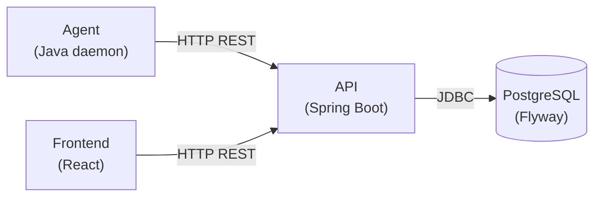
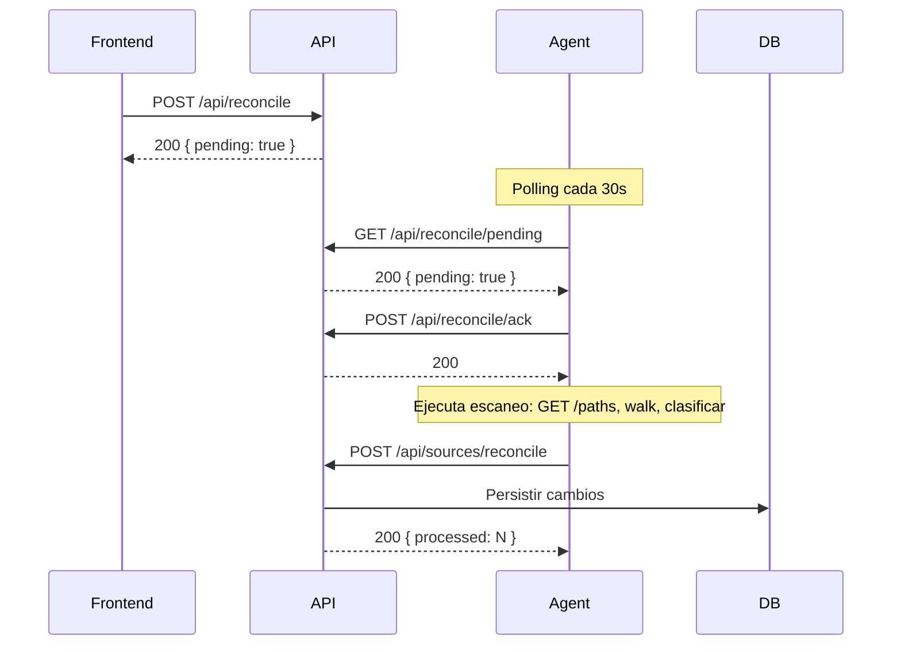
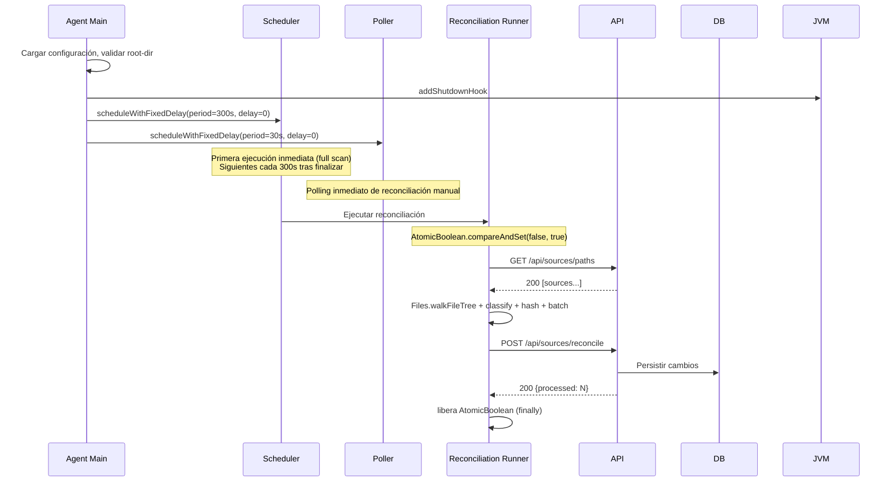
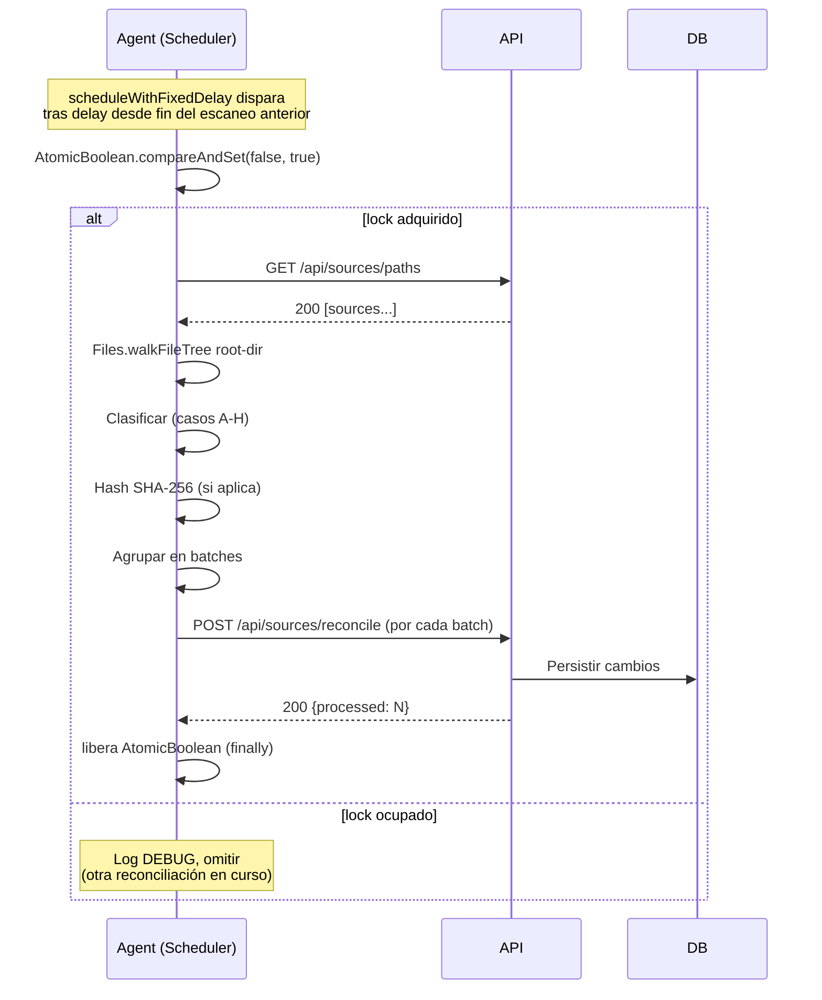

# architecture

## 0. Explicación de la organización de la documentación

La documentación de BiblioCat se compone de cuatro documentos principales más un conjunto de Archivos de Decisión
Arquitectónica (ADR). Cada documento cubre un nivel distinto del sistema, desde lo global hasta lo específico de cada
módulo.

| Documento      | Propósito                                                                            |
|----------------|--------------------------------------------------------------------------------------|
| `architecture` | Arquitectura global, principios, flujos del sistema, stack general                   |
| `api`          | API REST, modelo de datos, base de datos, migraciones, excepciones                   |
| `agent`        | Monitoreo del filesystem, sincronización, ciclo de vida del agente                   |
| `front`        | Componentes de UI, rutas, páginas, configuración del frontend                        |
| `Issue*`       | Problemas funcionales detectados, con severidad y estado. Ubicados en `docs/issues/` |

Las decisiones arquitectónicas documentadas (ADR) se encuentran en `docs/issues/decisions/`. Los comandos de build, test
y
desarrollo están definidos en `.opencode/commands/`.

Los issues funcionales se documentan en `docs/issues/`. Cada issue indica estado (resuelto, parcial, no resuelto),
severidad (🟩 1 mejora, 🟧 2 importante, 🟥 3 bloqueante) y, cuando aplica, la solución adoptada. Los issues
completamente resueltos se mueven a `docs/issues/resolved/`.

### 0.1. Scope por documento

#### architecture (documento global)

| Cubre                                       | No cubre                                       |
|---------------------------------------------|------------------------------------------------|
| Organización de la documentación            | Detalle de endpoints REST                      |
| Introducción y objetivo del sistema         | Especificación de modelos de datos             |
| Glosario de términos                        | Migraciones de base de datos                   |
| Capacidades y límites del usuario           | Implementación del agente (walkFileTree, etc.) |
| División en módulos y sus responsabilidades | Componentes de UI y páginas                    |
| Stack tecnológico general                   | Configuración específica de cada módulo        |
| Flujos del sistema (creación, eliminación)  | Guía de usuario o tutorial                     |

#### api (API)

| Cubre                                               | No cubre                        |
|-----------------------------------------------------|---------------------------------|
| Stack detallado del backend con versiones           | Arquitectura global del sistema |
| Endpoints REST (método, ruta, requests, responses)  | Monitoreo del filesystem        |
| Diagrama de capas (Controller, Service, Repository) | UI y componentes frontend       |
| Modelo de datos (ERD + tablas por entidad)          | Ciclo de vida del agente        |
| Migraciones Flyway                                  | Principios de diseño globales   |
| Excepciones y formato de error                      |                                 |
| Perfiles de configuración YAML                      |                                 |
| Estrategia de testing                               |                                 |

#### agent (agente)

| Cubre                                          | No cubre                        |
|------------------------------------------------|---------------------------------|
| Stack detallado del agente con versiones       | API REST y endpoints            |
| Diagrama de componentes internos               | Modelo de datos y entidades     |
| Sincronización entre FS y base de datos        | Migraciones de base de datos    |
| Ciclo de vida (inicio, cierre, eventos)        | UI y componentes frontend       |
| Procesos del agente (walkFileTree, hash, etc.) | Arquitectura global del sistema |
| Configuraciones y propiedades                  |                                 |
| Estrategia de testing                          |                                 |

#### front (frontend)

| Cubre                                      | No cubre                             |
|--------------------------------------------|--------------------------------------|
| Stack detallado del frontend con versiones | Backend (API, agente, base de datos) |
| Rutas y navegación de la SPA               | Arquitectura global del sistema      |
| Reglas estéticas y de UI                   | Modelo de datos                      |
| Páginas / vistas con sus layouts           | Migraciones Flyway                   |
| Variables de entorno y configuración       | Excepciones del backend              |

**Estado:** Todos los documentos están en borrador activo. El diseño aún se está refinando y puede cambiar. Si
encuentras contradicciones o puntos ambiguos, pregunta antes de implementar.

## 1. Introducción y objetivo

BiblioCat es un sistema de catálogo de biblioteca personal. Permite catalogar y gestionar archivos PDF, EPUB y MHTML
almacenados en el sistema de archivos local. El sistema **no almacena los archivos** — solo guarda metadatos y
referencias al filesystem.

Cuando se acumulan cientos o miles de documentos digitales en una carpeta, encontrar un archivo específico o mantener un
inventario de lo que se tiene se vuelve difícil. BiblioCat resuelve esto detectando los archivos en el
directorio de biblioteca, infiriendo autores desde la estructura de carpetas, y permitiendo búsqueda por metadatos
(nombre, autor, etiquetas, formato, año). Además, ante una pérdida accidental de archivos, el catálogo preserva los
metadatos como "póliza de seguro".

BiblioCat **no** es:

- Un gestor de descargas — no descarga archivos de URLs
- Un lector de PDF, EPUB o MHTML — no abre ni renderiza archivos
- Un motor de búsqueda de texto completo — solo busca por metadatos
- Un sistema de gestión documental empresarial — está pensado para uso personal
- Un sistema que almacena o modifica los archivos originales — solo los referencia

**Plataforma objetivo:** Windows (10/11). El sistema está diseñado y probado exclusivamente para el ecosistema Windows.

## 2. Glosario

| Término         | Definición                                                                                                                                                                                                      | Módulo                 |
|-----------------|-----------------------------------------------------------------------------------------------------------------------------------------------------------------------------------------------------------------|------------------------|
| Source          | Archivo PDF, EPUB o MHTML descubierto en el directorio de biblioteca y representado como registro en la base de datos.                                                                                          | API                    |
| Agent           | Daemon Java que sincroniza el catálogo con el filesystem mediante escaneos programados (inicio, periódico, manual) y comunica cambios a la API vía HTTP.                                                        | Agent                  |
| API             | Aplicación Spring Boot que expone endpoints REST, gestiona persistencia con JPA y ejecuta migraciones Flyway.                                                                                                   | API                    |
| Frontend        | Aplicación React que provee la interfaz de usuario para navegar y gestionar el catálogo.                                                                                                                        | Front                  |
| Reconciliation  | Proceso de sincronización entre el estado actual del filesystem y los registros en la base de datos.                                                                                                            | Agent + API            |
| Filesystem (FS) | Directorio local que contiene los archivos de biblioteca. Es la fuente de verdad del sistema.                                                                                                                   | Agent                  |
| Source format   | Discriminante de tipo de archivo: PDF, EPUB o MHTML.                                                                                                                                                            | API                    |
| Tag             | Etiqueta asignada por el usuario para categorizar sources. Relación muchos a muchos con sources.                                                                                                                | API + Front            |
| Write-race      | Condición de carrera donde el Agent intenta leer/hashear un archivo mientras este está siendo escrito por otro proceso. El Agent debe detectar y reintentar (backoff) para evitar hashes parciales o corruptos. | Agent                  |
| Soft delete     | Marcado de un registro como eliminado (se establece `deleted_at`) sin borrarlo físicamente. Los metadatos se preservan.                                                                                         | API                    |
| Content hash    | Hash SHA-256 del contenido del archivo. Usado para detectar renombres y safe-save.                                                                                                                              | Agent + API            |
| Orphan source   | Source cuyo archivo fue eliminado del FS pero cuyo registro de metadatos persiste en la base de datos (soft-delete). Puede ser reactivada si el archivo reaparece.                                              | API                    |
| Metadata        | Información asociada a un source en la base de datos: nombre, path, formato, año, edición, URL, autor, tags, content hash y timestamps. Se preserva durante el soft-delete y se transfiere en caso de rename.   | API                    |
| ADR             | Architecture Decision Record. Documento que registra una decisión arquitectónica, su contexto y consecuencias.                                                                                                  | docs/issues/decisions/ |

## 3. Qué puede hacer el usuario y qué no

### 3.1. Qué puede hacer

**Sources**

- Todos los sources provienen del filesystem. No existe alta manual desde el frontend.
- Puede editar año, edición y URL de un source.
- El autor se determina por la carpeta padre en el FS. Para cambiarlo, renombre la carpeta.
- El nombre del source solo se cambia desde el filesystem, no desde la aplicación.

**Borrado (2 etapas obligatorias)**

El borrado requiere dos etapas en orden:

1. Sacar o mover el archivo fuera del directorio de biblioteca en el FS. La aplicación lo detecta, aplica
   **soft-delete** y el source pasa a ser un **orphan source**. Los metadatos se preservan como seguro; si la source
   vuelve, se restablece como source normal.
2. Borrar el registro desde la aplicación. Esto elimina los metadatos (purge físico).

No es posible borrar archivo físico y metadatos en un solo paso para prevenir accidentes o fallos del disco del usuario.
Tampoco se puede purgar sources que no han sido removidas del FS antes.

**Autores**

- El autor se infiere automáticamente por el agente según la carpeta padre dentro del directorio raíz. Es la única forma
  de definir un autor.
- Si el archivo está en la raíz del directorio de biblioteca, el autor queda nulo.
- Si no se conoce el autor o es anónimo, se puede crear una carpeta "Anónimo" o similar y colocar el archivo allí.
- No se pueden crear o editar autores manualmente desde la aplicación.

**Tags**

- CRUD completo: crear, editar, eliminar tags.
- Asignar y des-asignar tags a sources.
- Filtrar y buscar por tag.

**Acciones del sistema**

- Disparar reconciliación manual desde el frontend.
- Filtrar sources por autor.
- Ver **orphan sources** (sources soft-deleteados cuyos metadatos persisten en la aplicación).

### 3.2. Qué no puede hacer

- Descargar archivos desde URLs.
- Leer o visualizar el contenido de PDF, EPUB o MHTML.
- Modificar metadatos desde el FS.
- Búsqueda de texto completo (solo búsqueda por metadatos).
- Crear sources manualmente (solo vía filesystem).
- Crear o editar autores manualmente (solo por estructura de carpetas).
- Borrar archivo físico y metadatos en un solo paso.
- Renombrar un source desde la aplicación (solo desde el FS).
- Reactivar manualmente un **orphan source** (la reactivación solo ocurre automáticamente cuando el archivo reaparece en
  el FS con el mismo content hash).

## 4. Explicación de los módulos y sus rutas

El sistema se divide en tres módulos independientes más una base de datos. Cada módulo vive en su propio directorio con
su propio sistema de build.

| Módulo        | Directorio | Entrypoint                        | Build                       |
|---------------|------------|-----------------------------------|-----------------------------|
| API           | `api/`     | `com.biblocat.api.ApiApplication` | Maven (`api/mvnw`)          |
| Agent         | `agent/`   | `com.biblocat.App`                | Maven (`agent/mvnw`)        |
| Frontend      | `front/`   | `src/main.tsx`                    | npm (`front/`)              |
| Base de datos | —          | —                                 | Flyway (gestionado por API) |

### 4.1. Por qué se dividió así

La división responde a cuatro principios de arquitectura:

1. **Separación de responsabilidades** — cada módulo tiene un concern bien definido y acotado: la API gestiona
   persistencia y lógica de dominio, el Agent monitorea el filesystem, el Frontend provee la interfaz de usuario.

2. **Filesystem como source of truth** — solo el Agent interactúa con el filesystem. La API y el Frontend nunca acceden
   al FS directamente, lo que evita problemas de locking, path confusion y lógica duplicada.

3. **API como única fuente de lógica de negocio** — toda validación, decisión de persistencia y regla de dominio reside
   en la API. Ningún otro módulo puede duplicar esta lógica.

4. **Agent como sensor, no actor** — el Agent detecta cambios y los reporta vía HTTP. No descarga, convierte, enriquece
   ni modifica archivos.

### 4.2. Responsabilidades de cada uno

| Módulo            | Responsabilidades                                                                                                                                                                                                                                             |
|-------------------|---------------------------------------------------------------------------------------------------------------------------------------------------------------------------------------------------------------------------------------------------------------|
| **API**           | Persistir y consultar metadatos en PostgreSQL. Exponer endpoints REST para CRUD y búsqueda. Ejecutar migraciones Flyway al iniciar. Validar datos de entrada. Coordinar eventos de sincronización enviados por el Agent.                                      |
| **Agent**         | Sincronizar el catálogo con el filesystem mediante tres mecanismos: escaneo al iniciar, escaneo periódico (cada 5 minutos) y escaneo manual. Computar SHA-256 de archivos. Inferir autores desde la estructura de carpetas. Enviar cambios a la API vía HTTP. |
| **Frontend**      | Mostrar el catálogo al usuario. Permitir búsqueda, filtros y edición de metadatos. Gestionar tags (CRUD y asignación). Disparar reconciliación manual.                                                                                                        |
| **Base de datos** | Almacenar metadatos de forma pasiva. No contiene triggers ni lógica de aplicación. Gestionada exclusivamente por Flyway desde la API.                                                                                                                         |

### 4.3. De qué NO se encarga cada uno

| Módulo            | No hace                                                                                                                                          |
|-------------------|--------------------------------------------------------------------------------------------------------------------------------------------------|
| **API**           | No accede al filesystem. No ejecuta monitoreo del filesystem. No contiene lógica de sincronización local.                                        |
| **Agent**         | No accede a la base de datos. No contiene lógica de dominio. No expone interfaz de usuario. No descarga, convierte ni modifica archivos.         |
| **Frontend**      | No contiene lógica de negocio. No accede al filesystem. No se comunica directamente con el Agent. Toda comunicación es vía HTTP REST con la API. |
| **Base de datos** | No es un proyecto independiente. No contiene lógica de aplicación (triggers, funciones). No se accede directamente desde el Agent o el Frontend. |

### 4.4. Diagrama de comunicación entre API, DB, Agente y Front

**Reglas de comunicación:**

- Agent ↔ API: HTTP REST (bidireccional — el Agent envía eventos, la API responde)
- Frontend ↔ API: HTTP REST (bidireccional — consultas y mutaciones)
- Frontend ↛ Agent: **prohibido**
- API ↛ Filesystem: **prohibido**
- Agent ↛ DB: **prohibido**

## 5. Stack general

| Capa                            | Tecnología                    | Versión       |
|---------------------------------|-------------------------------|---------------|
| Lenguaje backend (API y agente) | Java                          | 21            |
| Framework API                   | Spring Boot                   | 4.1           |
| Build backend                   | Maven (wrappers individuales) | —             |
| Base de datos                   | PostgreSQL                    | (por definir) |
| Migraciones                     | Flyway                        | (por definir) |
| Frontend                        | React                         | 19            |
| Lenguaje frontend               | TypeScript                    | 6             |
| Bundler                         | Vite                          | 8             |
| Linter                          | ESLint                        | —             |
| Formato de datos                | JSON                          | —             |
| Comunicación                    | HTTP REST                     | —             |

### 5.1. Stack que NO se va a utilizar

- Microservicios o service mesh — el monolito modular es suficiente para el alcance del proyecto
- Message brokers (RabbitMQ, Kafka) — la comunicación HTTP directa entre Agent y API es adecuada
- Búsqueda de texto completo (ElasticSearch, Solr) — solo se busca por metadatos
- Spring Boot en el Agent — el Agent es una aplicación Java liviana sin necesidad de DI
- Docker, Kubernetes o cualquier infraestructura de contenedores — no está contemplada en V1
- ORM en el Agent — usa únicamente HttpClient plano para comunicarse con la API
- APIs de IA, embeddings o procesamiento de lenguaje natural

### 5.2. Links a los stacks detallados de cada módulo

- API → [`api.md`](api.md) §1
- Agent → [`agent.md`](agent.md) §1
- Frontend → [`front.md`](front.md) §1

## 6. Comportamientos y flujos de datos

Los flujos se organizan por el origen del trigger que los inicia: el filesystem (FS), el usuario o el propio sistema.

### 6.1. FS-triggered

Flujos iniciados por cambios en el filesystem, detectados durante escaneos.

Los cuatro flujos que siguen (creación, rename, eliminación y reactivación) no son procesos independientes. Se resuelven
mediante un **único proceso de reconciliación** que el Agent ejecuta en cada escaneo. Las fases del proceso son:

1. **Consultar** — el Agent solicita a la API el estado conocido de todos los sources (`GET /api/sources/paths`).
2. **Escanear y clasificar** — el Agent recorre el FS con `Files.walkFileTree()` + `SimpleFileVisitor`, lista los
   archivos y clasifica cada uno contra
   el estado conocido.
3. **Hashear** — computa SHA-256 para cada archivo. No hay optimización activa (ver
   `docs/issues/ISSUE-04-OmitirHashEscaneosSubsecuentes.md` para
   estrategias futuras).
4. **Enviar** — agrupa las operaciones en batches y las envía a la API (`POST /api/sources/reconcile`).
5. **Persistir** — la API aplica cada operación según su tipo.

La tabla de clasificación que el Agent aplica es la siguiente:

| # | Condición                                  | Clasificación           | Flujo  |
|---|--------------------------------------------|-------------------------|--------|
| A | Path en API + hash igual + no eliminado    | Sin cambios             | —      |
| B | Path en API + hash igual + eliminado       | Reactivación            | §6.1.4 |
| C | Path en API + hash distinto + no eliminado | Modificado (safe-save)  | §6.1.2 |
| D | Path nuevo + hash existe en otro source    | Rename                  | §6.1.2 |
| E | Path nuevo + hash no existe                | Creación                | §6.1.1 |
| F | Path en API pero no en FS + no eliminado   | Soft-delete             | §6.1.3 |
| G | Path en API pero no en FS + ya eliminado   | Sigue siendo orphan     | —      |
| H | Path en API + hash distinto + eliminado    | Creación (orphan sigue) | §6.1.1 |

Cada sub-sección detalla el trigger, los pasos y las notas particulares de cada flujo.

#### 6.1.1. Creación de source

**Trigger:** Archivo nuevo aparece en el directorio de biblioteca.

**Componentes involucrados:** FS → Agent → API → DB

**Pasos:**

1. Agent detecta archivo durante escaneo: path no existe en API, hash (computado) tampoco.
2. Agent computa hash SHA-256 del archivo.
3. Agent infiere el autor desde la carpeta padre (o `null` si está en raíz).
4. Agent determina el formato por extensión (`.pdf`, `.epub`, `.mhtml`).
5. Agent envía operación `CREATE` a la API dentro de un batch.
6. API busca o crea la entidad Author por nombre, crea el Source y responde.

**Notas:**

- El autor se infiere de la carpeta padre inmediata dentro del directorio raíz.
- Si el archivo está en la raíz, el autor queda nulo (`author_id = NULL`).
- El nombre del source se toma del nombre del archivo.
- Los metadatos editables (año, edición, URL, tags) se inicializan vacíos.

#### 6.1.2. Renombrar / mover source (incluye safe-save)

**Trigger:** Archivo cambia de path o es reemplazado en el mismo path dentro del FS.

**Componentes involucrados:** FS → Agent → API → DB

**Pasos:**

1. Agent detecta archivo durante escaneo.
    - Si el path es nuevo, pero el hash coincide con otro source → **rename**.
    - Si el path ya existe en API (no eliminado) y el hash cambió → **modificación** (safe-save).
    - Si el path ya existe en API pero está eliminado (`deletedAt ≠ null`) y el hash cambió → **creación** (§6.1.1).
2. Agent envía operación `RENAME` o `UPDATE` a la API.
3. API actualiza path, hash y/o autor del source existente.

**Notas:**

- La detección de rename requiere consultar tanto por path como por content hash.
- Si el rename cambia la carpeta padre, el Agent re-infere el autor del nuevo path y lo envía en la operación RENAME; la
  API solo persiste el valor recibido.
- El safe-save se detecta porque el contenido fue reemplazado en el mismo path (hash distinto).
- Los metadatos editables por el usuario se preservan durante el rename.
- El autor se re-infere del nuevo path automáticamente por el Agent (quien lo envía en la operación RENAME). La API solo
  persiste el valor recibido. Ver reglas de inferencia en `agent.md` §2.7.

#### 6.1.3. Eliminación de source (soft-delete)

**Trigger:** Archivo es borrado del FS.

**Componentes involucrados:** FS → Agent → API → DB

**Pasos:**

1. Agent detecta source registrado en API cuyo path no existe en el FS.
2. Agent verifica que el source no esté ya eliminado (`deleted_at = null`).
3. Agent envía operación `DELETE` a la API.
4. API aplica soft-delete: establece `deleted_at` con la fecha actual.
5. El source pasa a ser un **orphan source**. Sus metadatos se preservan.

**Notas:**

- Es soft-delete obligatorio. No se puede purgar sin antes haber eliminado el archivo del FS.
- Mientras sea orphan, los metadatos (autor, año, tags, etc.) permanecen intactos.
- El usuario puede ver los orphan sources desde el frontend y purgarlos.

#### 6.1.4. Reactivación de orphan source

**Trigger:** Archivo reaparece en el FS después de haber sido borrado (mismo content hash).

**Componentes involucrados:** FS → Agent → API → DB

**Pasos:**

1. Agent detecta archivo en el FS cuyo path coincide con un source soft-deleteado.
2. Agent computa hash y confirma que coincide con el hash almacenado.
3. Agent envía operación `REACTIVATE` a la API.
4. API limpia `deleted_at` (lo pone a `null`). El source vuelve a estado activo.

**Notas:**

- La reactivación solo ocurre automáticamente. No hay reactivación manual.
- Si el archivo reaparece con distinto hash, no se reactiva (se clasifica como creación, §6.1.1).
- El source reactivado conserva todos sus metadatos anteriores (tags, año, edición, URL).

### 6.2. User-triggered

Flujos iniciados por acciones del usuario desde el frontend.

#### 6.2.1. Editar metadatos (Pendiente)

**Trigger:** Usuario modifica año, edición o URL de un source.

**Componentes involucrados:** Front → API → DB

**Diagrama Mermaid:** *(pendiente)*

**Enumeración de pasos:** *(pendiente)*

**Notas:** *(pendiente)*

#### 6.2.2. Purga de orphan source (Pendiente)

**Trigger:** Usuario elimina definitivamente un orphan source desde la aplicación.

**Componentes involucrados:** Front → API → DB

**Diagrama Mermaid:** *(pendiente)*

**Enumeración de pasos:** *(pendiente)*

**Notas:** *(pendiente)*

#### 6.2.3. Reconciliación manual

**Trigger:** Usuario dispara una sincronización desde el frontend.

**Componentes involucrados:** Front → API → Agent → API → DB

**Diagrama Mermaid:**

**Enumeración de pasos:**

1. El frontend llama a `POST /api/reconcile`.
2. La API setea `reconciliation_pending = true` en la base de datos y responde inmediatamente.
3. El Agent, cada `biblocat.agent.poll.interval-seconds` (default: 30), consulta `GET /api/reconcile/pending`.
4. Si `pending = true` y **no** hay otra reconciliación en curso, el Agent:
    - Llama a `POST /api/reconcile/ack` para resetear el flag.
    - Inicia el escaneo completo (ver §6.1: consulta paths, walk, clasificar, hash, batch, POST reconcile).
5. Si `pending = true` pero hay otra reconciliación en curso, el Agent omite el intento (log DEBUG). El próximo poll lo
   reintentará.
6. El escaneo se ejecuta normalmente. No hay resultado de vuelta al frontend — el usuario ve los cambios consultando la
   lista de sources.

**Notas:**

- La reconciliación manual es **asíncrona**: la API responde inmediatamente, la ejecución ocurre en el Agent vía
  polling.
- Si el Agent crashea después del ack pero antes del escaneo, el flag ya se reseteó. La reconciliación se recupera en el
  próximo escaneo programado (cada 5 minutos).
- La superposición con reconciliaciones periódicas se maneja mediante `AtomicBoolean` (ver `agent.md` §2.8 EC35).

### 6.3. System-triggered

Flujos iniciados por el propio ciclo de vida del Agent.

#### 6.3.1. Inicio del Agent (full scan)

**Trigger:** El Agent se inicia (JVM launch) y ejecuta un escaneo completo del FS inmediatamente.

**Componentes involucrados:** Agent → API → DB

**Diagrama Mermaid:**

**Enumeración de pasos:**

1. `Agent.main()` carga la configuración desde propiedades (o CLI args). Valida que el directorio raíz exista y sea un
   directorio. Resuelve symlinks con `rootDir.toRealPath()`.
2. Registra un ShutdownHook en la JVM para interrupción graceful de los executors.
3. Crea el **Scheduler** (`ScheduledExecutorService`, 1 hilo) con
   `scheduleWithFixedDelay(task, delay=0, period=scan.period-seconds)`. El `delay=0` fuerza un full scan inmediato al
   arrancar.
4. Crea el **Poller** (`ScheduledExecutorService`, 1 hilo) con
   `scheduleWithFixedDelay(task, delay=0, period=poll.interval-seconds)`. Comienza a sondear reconciliaciones manuales
   inmediatamente.
5. **Race en t=0:** Scheduler y Poller arrancan simultáneamente y compiten por el `AtomicBoolean` (
   `compareAndSet(false, true)`). El primero que lo adquiere ejecuta la reconciliación de inicio. El otro loguea DEBUG y
   omite su ejecución.
6. La reconciliación ejecuta el pipeline completo descrito en §6.1:
    - Consulta el estado conocido (`GET /api/sources/paths`) con reintentos configurables.
    - Recorre el FS (`Files.walkFileTree` + `SimpleFileVisitor`), filtra por extensión (`.pdf`, `.epub`, `.mhtml`).
    - Clasifica cada archivo contra el estado conocido (tabla de §6.1, casos A-H).
    - Computa SHA-256 para los archivos que lo requieren.
    - Agrupa operaciones en batches (default: 50) ordenados: RENAME → UPDATE → REACTIVATE → CREATE → DELETE.
    - Envía cada batch a la API (`POST /api/sources/reconcile`) con reintentos y backoff.
7. La API persiste los cambios en la base de datos.
8. Al finalizar (éxito o error), libera el `AtomicBoolean` en un bloque `finally`.

**Notas:**

- El Scheduler usa `delay = 0` para garantizar que el catálogo se sincronice inmediatamente al arrancar el Agent, sin
  esperar al primer intervalo periódico.
- La race condition en `t=0` entre Scheduler y Poller es **correcta por diseño**: cualquiera de los dos puede ejecutar
  el primer escaneo. El perdedor lo reintenta en su próximo ciclo.
- El ShutdownHook se registra **antes** de arrancar los executors para asegurar que captura cualquier interrupción,
  incluso si ocurre durante el bootstrap.
- Si el root-dir no existe al iniciar, el Agent aborta con código de salida ≠ 0 y no arranca los executors. Requiere
  intervención del usuario.

#### 6.3.2. Reconciliación periódica

**Trigger:** Timer interno del Agent (cada `biblocat.agent.scan.period-seconds`, default: 300s = 5 minutos).

**Componentes involucrados:** Agent → API → DB

**Diagrama Mermaid:**

**Enumeración de pasos:**

1. El `ScheduledExecutorService` dispara la reconciliación periódica tras el intervalo configurado, medido desde el fin
   del escaneo anterior (`scheduleWithFixedDelay`).
2. El Agent intenta adquirir el `AtomicBoolean.reconciliationInProgress` con `compareAndSet(false, true)`.
    - Si retorna `false` → hay otra reconciliación en curso (manual o periódica superpuesta) → log DEBUG, omitir. El
      próximo ciclo lo reintenta.
    - Si retorna `true` → lock adquirido, continuar.
3. El Agent ejecuta el pipeline completo de reconciliación (idéntico al de §6.1):
    - Consulta `GET /api/sources/paths` con reintentos (default: 3, backoff 2s/4s/8s). Si se agotan, aborta la
      reconciliación y libera el lock.
    - Recorre el FS con `Files.walkFileTree(rootDir, options, maxDepth, visitor)` + `SimpleFileVisitor`. Filtra por
      extensión (`.pdf`, `.epub`, `.mhtml`). Normaliza
      paths.
    - Clasifica cada archivo contra el estado conocido aplicando la tabla de §6.1.
    - Computa SHA-256 para los casos que lo requieren (B, C, D, E, H) con timeout y detección de write-race.
    - Agrupa operaciones en batches de hasta `batch.size` (default: 50), ordenados: RENAME → UPDATE → REACTIVATE →
      CREATE → DELETE.
    - Envía cada batch secuencialmente a `POST /api/sources/reconcile`.
4. La API persiste los cambios en la base de datos y responde con el resumen de operaciones procesadas.
5. Al finalizar (éxito o error), libera el `AtomicBoolean` en un bloque `finally`.

**Notas:**

- El uso de `scheduleWithFixedDelay` (no `scheduleAtFixedRate`) garantiza que el intervalo se mide desde el **fin** de
  una ejecución hasta el **inicio** de la siguiente. Si el escaneo tarda más que el período configurado, la siguiente
  ejecución espera a que termine + el delay. No se saltan reconciliaciones.
- El `AtomicBoolean` es una salvaguarda secundaria: `scheduleWithFixedDelay` ya impide la auto-superposición del
  Scheduler, pero el lock protege contra superposición con reconciliaciones manuales disparadas por el Poller (§6.2.3).
- La primera reconciliación periódica no ocurre hasta 300s después del full scan de inicio (§6.3.1). Esto evita dos
  escaneos consecutivos al arrancar.
- Configuraciones relevantes: `biblocat.agent.scan.period-seconds` (default: 300), `biblocat.agent.scan.max-depth` (
  default: 10), `biblocat.agent.batch.size` (default: 50). Ver `agent.md` §4.1 para la lista completa.
